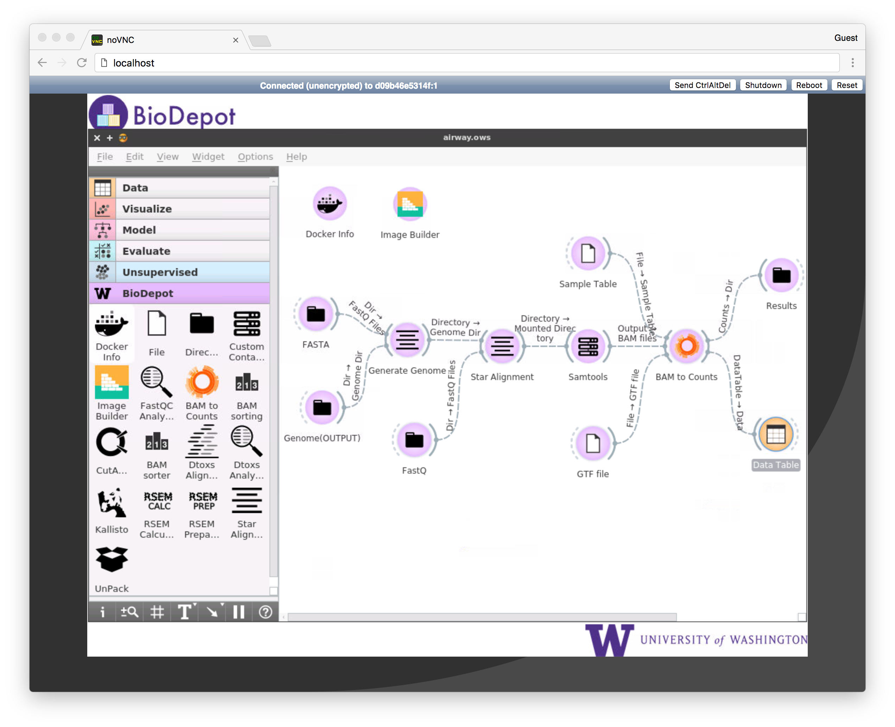

[](https://microbadger.com/images/biodepot/bwb "Get your own image badge on microbadger.com")  [](https://microbadger.com/images/biodepot/bwb "Get your own version badge on microbadger.com")


# BioDepot Workflow Builder (BwB)

BioDepot is a self-contained tool with graphical user interface for bioinformatic workflows. The package is based on Orange 3 by Biolab and NoVnc. Widgets are mainly written in Python (Qt5, Docker-Py, PyQt5).

## Requirements  

- Docker 1.13.0  
- Internet Browser  

## Running BwB
Currently, BwB uses docker sock binding, to run BwB:

1. Install Docker   
2. On Docker-enabled machines run:  
``` 

docker run --rm 
-p 6080:6080 -v ~/Desktop/:/data -v /var/run/docker.sock:/var/run/docker.sock
 biodepot/bwb

```
3. BwB can be accessed from browser: 
http://localhost:6080 (for windows machines, you'll need to know the address of your docker-machine)  


## Developing Widget
To add a widget to BioDepot:

1. Download BioDepot source codes:
 `https://github.com/BioDepot/BioDepot-workflow-builder/tree/master/biodepot` 
  
2. Locate to folder orangebiodepot (eg: `~/Desktop/biodepot/orangebiodepot`)
  
3. Write the widget (or copy any of existing widgets and modify as necessary)
  
4. On BwB, run xterm and locate to the shared widget location (e.g: /data/biodepot)
  
5. Rebuild BioDepot and rerun Orange:
  

```
    pip3 uninstall BioDepot

    pip3 install -e .
    orange-canvas
```



## More resources:
- Demo: [Link](https://drive.google.com/file/d/0B6xuS_tbRDJ0RzN6NlJ0T1U4VUU/view?usp=sharing)
- Manual: [Manual](https://github.com/kristiyanto/BioDepot-workflow-builder/blob/master/simplified_manual.pdf)