# BioDepot-Workflow-builder (Bwb)

  
   

Bioinformatics Group
University of Washington Tacoma

# Table of Contents
   * [FAQ](#faq)
      * [General](#general)
         * [Why should I use Bwb?](#why-should-i-use-bwb)
      * [Usage](#usage)
         * [How do I use Bwb on my own data files?](#how-do-i-use-bwb-on-my-own-data-files)
         * [How do I connect one widget to another?](#how-do-i-connect-one-widget-to-another)
         * [How do I run Bwb on the cloud?](#how-do-i-run-bwb-on-the-cloud)
         * [What browser should I use with Bwb?](#what-browser-should-i-use-with-bwb)
         * [Where are the sample workflows and datasets?](#where-are-the-sample-workflows-and-datasets)
         * [Is it possible to use Bwb to run a batch of datasets?](#is-it-possible-to-use-bwb-to-run-a-batch-of-datasets)
         * [How do I add my own scripts to a Bwb pipeline?](#how-do-i-add-my-own-scripts-to-a-bwb-pipeline)
      * [Common problems](#common-problems)
         * [I'm having problems with windows](#im-having-problems-with-windows)
         * [My window is too small](#my-window-is-too-small)
         * [STAR and Kallisto won't run](#star-and-kallisto-wont-run)
         * [The Bwb container won't build on Windows when using the git repository](#the-bwb-container-wont-build-on-windows-when-using-the-git-repository)
      * [Miscellaneous](#miscellaneous)
         * [How should I reference Bwb if I use it?](#how-should-i-reference-bwb-if-i-use-it)
   * [MANUAL](#manual)
      * [GENERAL INFORMATION](#general-information)
         * [Overview: Running Bwb](#overview-running-bwb)
      * [Installing and starting Docker](#installing-and-starting-docker)
         * [Linux](#linux)
         * [macOS](#macos)
         * [Windows](#windows)
         * [On The Cloud](#on-the-cloud)
            * [Amazon AWS](#amazon-aws)
      * [Starting Bwb](#starting-bwb)
      * [The Bwb/fluxbox work environment](#the-bwbfluxbox-work-environment)
         * [Graphics support for containerized apps](#graphics-support-for-containerized-apps)
         * [Basic window manipulations](#basic-window-manipulations)
         * [Application menu](#application-menu)
         * [Multiple Bwb instances and workspaces](#multiple-bwb-instances-and-workspaces)
         * [Interaction with host windowing system](#interaction-with-host-windowing-system)
      * [Bwb application](#bwb-application)
         * [Bwb window with kallisto-sleuth-jupyter workflow showing main features](#bwb-window-with-kallisto-sleuth-jupyter-workflow-showing-main-features)
         * [Bwb fluxbox desktop with Bwb minimized](#bwb-fluxbox-desktop-with-bwb-minimized)
         * [Overview](#overview)
         * [Tool Dock](#tool-dock)
         * [Editing the Tool dock](#editing-the-tool-dock)
         * [Interacting with widgets](#interacting-with-widgets)
            * [Widget user interaction window](#widget-user-interaction-window)
               * [Required parameters screen](#required-parameters-screen)
               * [Optional parameters screen](#optional-parameters-screen)
               * [Console screen](#console-screen)
               * [Execution bar](#execution-bar)
                  * [Start](#start)
                  * [Stop](#stop)
                  * [Export graphics](#export-graphics)
                  * [Test mode](#test-mode)
                  * [Run mode](#run-mode)
                  * [Select triggers](#select-triggers)
            * [Widget definition window](#widget-definition-window)
               * [General tab](#general-tab)
                  * [description](#description)
                  * [docker_image_name](#docker_image_name)
                  * [docker image tag](#docker-image-tag)
                  * [priority](#priority)
                  * [icon](#icon)
               * [Inputs tab](#inputs-tab)
               * [Outputs tab](#outputs-tab)
               * [Volumes tab](#volumes-tab)
               * [Ports tab](#ports-tab)
               * [Parameters tab](#parameters-tab)
               * [Command tab](#command-tab)
               * [Docker tab](#docker-tab)
               * [Widget definition save options and further customization by editing the .py file](#widget-definition-save-options-and-further-customization-by-editing-the-py-file)
                  * [Save mode: Overwrite](#save-mode-overwrite)
                  * [Save mode: Merge](#save-mode-merge)
                  * [Save mode: Data](#save-mode-data)
                  * [Load button](#load-button)
         * [Building workflows from widgets](#building-workflows-from-widgets)
            * [TLDR;](#tldr)
            * [Workflow structure](#workflow-structure)
            * [Connecting widgets](#connecting-widgets)
               * [Input from connections override user input](#input-from-connections-override-user-input)
               * [Connections to triggers are used to control the execution of widgets](#connections-to-triggers-are-used-to-control-the-execution-of-widgets)
            * [Saving workflows](#saving-workflows)
            * [Loading and executing a workflow](#loading-and-executing-a-workflow)
            * [Testing and exporting workflows as a bash script](#testing-and-exporting-workflows-as-a-bash-script)
      * [Demo workflows](#demo-workflows)
         * [DToxS demo](#dtoxs-demo)
         * [kallisto-sleuth demo](#kallisto-sleuth-demo)
         * [kallisto-sleuth with Jupyter demo](#kallisto-sleuth-with-jupyter-demo)
         * [STAR demo](#star-demo)
      * [Tutorial - Adding a Python script to a Bwb workflow](#tutorial---adding-a-python-script-to-a-bwb-workflow)
         * [Overview](#overview-1)
         * [Add Python2 widget to the kallisto-sleuth-jupyter workflow](#add-python2-widget-to-the-kallisto-sleuth-jupyter-workflow)
         * [Rename and customize the Python2 widget](#rename-and-customize-the-python2-widget)
         * [Creating the Docker image](#creating-the-docker-image)
         * [Save widget and load the workflow again](#save-widget-and-load-the-workflow-again)
         * [Creating or copying the wrapper Python script](#creating-or-copying-the-wrapper-python-script)
         * [Connecting the widget to the workflow](#connecting-the-widget-to-the-workflow)
         * [Running and testing the workflow](#running-and-testing-the-workflow)
      * [Appendices](#appendices)
         * [1. Development environment](#1-development-environment)
         * [How Bwb executes workflows](#how-bwb-executes-workflows)
            * [TLDR;](#tldr-1)
         * [Organization of code](#organization-of-code)
            * [coreutils](#coreutils)
               * [BwBase](#bwbase)
               * [DockerClient](#dockerclient)
               * [OWWidgetBuilder](#owwidgetbuilder)
               * [createWidget](#createwidget)
            * [OWBiocImageBuilder](#owbiocimagebuilder)
            * [ToolDockEdit](#tooldockedit)
            * [makeToolDockCategories](#maketooldockcategories)
            * [workflowTools](#workflowtools)
         * [Organization of widget definition directory](#organization-of-widget-definition-directory)
         * [Organization of workflow directory](#organization-of-workflow-directory)
         * [List and description of included widgets](#list-and-description-of-included-widgets)
            * [Scripting widgets](#scripting-widgets)
               * [bash_utils](#bash_utils)
               * [bioc_R](#bioc_r)
               * [Java8](#java8)
               * [Perl](#perl)
               * [Python2](#python2)
               * [Python3](#python3)
            * [Jupyter widgets:](#jupyter-widgets)
               * [jupyter_base](#jupyter_base)
               * [jupyter_bioc](#jupyter_bioc)
               * [jupyter_sleuth](#jupyter_sleuth)
            * [RNA_seq:](#rna_seq)
               * [deseq2](#deseq2)
               * [DtoxSAnalysis](#dtoxsanalysis)
               * [DtoxSAlignment](#dtoxsalignment)
               * [kallistoIndex](#kallistoindex)
               * [kallistoQuant](#kallistoquant)
               * [starIndex](#starindex)
               * [starAlign](#staralign)
               * [startodeseq2](#startodeseq2)
               * [sleuth](#sleuth)
            * [Miscellaneous:](#miscellaneous-1)
               * [Directory](#directory)
               * [File](#file)
            * [User:](#user)
            * [Utilities:](#utilities)
               * [downloadURL](#downloadurl)
               * [fastqc](#fastqc)
               * [fastqDump](#fastqdump)
               * [gnumeric](#gnumeric)
         * [Description of json descriptors for widgets (Note that some of this may be outdated)](#description-of-json-descriptors-for-widgets-note-that-some-of-this-may-be-outdated)
         * [BwBase class](#bwbase-class)
            * [Keeping track of connections](#keeping-track-of-connections)
            * [Handling input signals](#handling-input-signals)
            * [Drawing an managing the GUI form](#drawing-an-managing-the-gui-form)
            * [Launching the executable with Docker](#launching-the-executable-with-docker)

# FAQ
## General

### Why should I use Bwb?

#### Biomedical scientists 

The Bwb GUI is designed for non-programmers who want to use a workflow on their own data without worrying about installation and reproducibility. Bwb auto-installs the components and provides a very simple and intuitive GUI interface for modifying key parameters and accepting user files. We realise that for many users, interactive visualization is a large part of their analyses and Bwb supports Jupyter notebooks, Cytoscape and other software that have their own graphics and GUIs. The casual user can use familiar tools to customize the final stages of the analyses while maintaining a complete record and provenance of the entire pipeline which is essential for publication, sharing and reproducibility. Advanced users can swap in different parameter sets or even different modules just by dragging and dropping into an existing tested pipeline. A bash script can be created for the purpose of publication or to use in one of the many schedulers that support bash scripts such as SLURM/SGE/Torque-Maui.

#### Bioinformaticians

Bwb is also designed for bioinformaticians who support a group of users by analyzing data and installing and customizing workflows. For data analyses, bioinformaticians can more easily implement new pipelines and document existing ones using Bwb's GUI and support for Jupyter notebooks. Furthermore, Bwb pipelines can reduce the workload for bioinformaticians as users are able auto-install pre-tested workflows and adapt workflows by tweaking parameters on their own through a familiar interface. There is no need to re-implement a pipeline after a minor OS or package upgrade, or for new hardware. In addition, the widget building utilities allow the bioinformaticians to quickly customize the parameters and components that are exposed to the end user. Bwb also comes with widgets that support the major scripting languages used in Bioinformatics: Python, R, Perl, Bash and Java to allow for rapid customization, implementation and testing of new workflows. We provide a [tutorial](#tutorial---adding-a-python-script-to-a-bwb-workflow) and [video](https://www.youtube.com/watch?v=jtu-jCU2DU0) showing how to add a custom script to a Bwb pipeline. The export of Docker bash scripts allows for portable documentation of the workflows and execution on job schedulers, or for inclusion in custom scripts. 

#### Software tool developers

A major motivation for our development of Bwb was that our own software tools were not being adopted or even tested by may users. The barriers of installing and integrating new software into existing workflows are very high. By providing a GUI and an auto-installation method across different platforms, the adoption costs are greatly reduced. **Bwb is NOT meant to be a visual programming language** as this we find this a cumbersome method for writing software and probably too complicated to be used by users without a programming background. Bwb is designed to allow the developer an mechanism to provide a consistent and intuitive GUI for their software that largely consists of filling out a set of forms. In some cases, an additional wrapper script may be needed. Filling out the Bwb forms to skin an application is usually less work than the alternatives of writing a custom GUI, providing or conforming to a web-based API, writing, or dragging-and-dropping together a script toe create a workflow one or more workflow description languages. Our test cases are examples of ready-to-run modifiable workflows that self-install executables, dependencies and data. Bwb workflows can be added, for example, to a GitHub to encourage users to try out new software.

## Usage

### How do I use Bwb on my own data files?
The mapping of local files to be used by Bwb workflows happens in the command line at launch time.

The -v option allows you to map one or more personal (local) directory to an internal directory that the Bwb container can see them. Usually we map them to /data internally. The following start command for example maps the current directory to the /data directory inside the container. 
```
docker run --rm   -p 6080:6080 \
    -v  $pwd/:/data  \
    -v  /var/run/docker.sock:/var/run/docker.sock \
    -v /tmp/.X11-unix:/tmp/.X11-unix \
    --privileged --group-add root \
    biodepot/bwb
 ```
 whereas the following maps the home directory of myUser to /data
 ```
docker run --rm   -p 6080:6080 \
    -v  /home/myUser/:/data  \
    -v  /var/run/docker.sock:/var/run/docker.sock \
    -v /tmp/.X11-unix:/tmp/.X11-unix \
    --privileged --group-add root \
    biodepot/bwb
 ```
In other words, the Bwb container can read and write files to your local directory by reading and writing to the /data directory (or whatever directory you choose). This directory (/data) will be created automatically by Bwb. You will then be able to interact with files through the /data directory on Bwb. Bwb knows about these mappings or mountpoints and automatically handles all the filename mapping to any containers that it launches in the workflows by using these mountpoints.

More than one mapping is possible. The following maps the home directory of myUser to /data and the /opt/sequenceData directory on the host to /sequenceData in Bwb. Just make sure that the mappings are not contradictory or unexpected things will happen.

```
docker run --rm   -p 6080:6080 \
    -v  /home/myUser/:/data  \
    -v  /opt/sequenceData:/sequenceData \
    -v  /var/run/docker.sock:/var/run/docker.sock \
    -v /tmp/.X11-unix:/tmp/.X11-unix \
    --privileged --group-add root \
    biodepot/bwb
 ```
 
### How do I connect one widget to another?

Drag the mouse from the right side of the source widget to the left side of the sink widget. If they can be connected a dialog box should appear allowing you to choose which widgets to connect. This is shown in our [video](#tutorial---adding-a-python-script-to-a-bwb-workflow) at 5:49 to 6:05.

### How do I run Bwb on the cloud?
Bwb is a containerized mini webserver that can be run on any platform. To run it on the cloud requires you to make the ip and port accessible to the user. An example is given here for [AWS](#amazon-aws)

### What browser should I use with Bwb?

We recommend Chrome, only because most of our testing has been done using Chrome. However, any modern browser that has support for HTML5 is fine. In the past we have with Edge but the latest versions of Firefox and Safari work well. If you must use Edge it **may** be possible to use by following this [recipe](https://www.hanselman.com/blog/FixedMicrosoftEdgeCantSeeOrOpenVirtualBoxhostedLocalWebSites.aspx) to allow it to connect to a local URL or by running Bwb from a remote server.

### Where are the sample workflows and datasets?
Bwb includes a set of sample workflows. These are found under the /workflows directory. Data are typically **NOT** included with the containers. This maximizes the portability of the containers for different workflows and makes them easier to download. Instead we use of the provided downloadURL widget to download files from an external source (eg. Google drive) for use with the containers. This is the mechanism that we use in all our examples. You can use our widget to download the data or look at the widget parameters to find the URL of the files and download them yourself. Then you can save these files if you wish and use them directly.

### Is it possible to use Bwb to run a batch of datasets?
Currently, this is possible in a couple of ways:

1) A wrapper script can be used inside the widget to distribute the computing to multiple threads. An example is [here] (https://github.com/BioDepot/LINCS_RNAseq_cpp/blob/master/scripts/multibwa.sh)

2) Export the pipeline as a [bash script](#testing-and-exporting-workflows-as-a-bash-script) and modify the scripts to be used with a HPC scheduler such as SLURM, SGE or Torque-Maui. One could also use the script as the basis for a CWL or WDL descriptor for the workflow.

We do have a built-in job scheduler that is under development for Bwb. You can take a look at the latest upstream build with this at the iterate2 branch of the GitHub.

### How do I add my own scripts to a Bwb pipeline?
We have provided basic widgets for Python, R, Perl, Bash, and Java. There is a [tutorial](#tutorial---adding-a-python-script-to-a-bwb-workflow) and a [video](https://www.youtube.com/watch?v=jtu-jCU2DU0)  showing how to add a script to a Bwb pipeline.

## Common problems

### I'm having problems with windows

1. Check that virtualization is turned on. This may require booting into BIOS by restarting and pressing a function key (typically F1, F8 or F10). 
2. If you are using VirtualBox (Docker toolbox) make sure that you allow Docker to install it i.e. you should uninstall Virtualbox if there is a previous installation before running the Docker installer.
3. Make sure that you have read/write permissions to the directory that you using to share files with Bwb and Docker. One method is use your Desktop or a folder on your Desktop as the starting point for sharing files. For example when launching from Docker toolbox the starting command would be

```
docker run --rm   -p 6080:6080 \
    -v  /c/Users/Desktop:/data  \
    -v  /var/run/docker.sock:/var/run/docker.sock \
    -v /tmp/.X11-unix:/tmp/.X11-unix \
    --privileged --group-add root \
    biodepot/bwb
```    
### My window is too small
Try the following:
1. Open a new browser window
2. Maximize the window
3. Type in the url to connect to Bwb but do not let it auto-complete e.g. localhost:6080 **NOT** localhost:6080/vnc_auto.html

The technical explanation is that Bwb resizes to the window size that it detects when it is first connected to a browser by cycling through a series of different endpoints. However, the last url may get cached and may skip the resizing steps.

### STAR and Kallisto won't run
There are two common reasons:
1. These applications have RAM requirements. For the datasets in question, Kallisto requires about 7 GB of RAM and STAR requires about 30 GB of RAM. This amount of memory must be available on your host or the application will crash or run very slowly.

2. For systems running Docker using a Virtual Machine (VM) the VM is set to use a maximum amount of RAM. For Windows machines, this can be as low as 1 GB. The amount of RAM available to the VM must be adjusted. Instructions to adjust the VM size for the latest Docker versions are [here](https://docs.docker.com/docker-for-windows/#advanced) For earlier VirtualBox based installations (i.e. Windows 10 Home, older Macs), a video how to do this is [here](https://www.youtube.com/watch?v=lLuIVGNfM4w).

### The Bwb container won't build on Windows when using the git repository
The two most common causes for this are the length of the internal filenames used by git and the difference between linefeeds used by Windows/DOS and Unix.

```
git config --global core.autocrlf input
git config --system core.longpaths true
git clone https://github.com/BioDepot/BioDepot-workflow-builder
```
The container should build correctly now.

## Miscellaneous
### How should I reference Bwb if I use it?
Please reference our biorXiv preprint https://www.biorxiv.org/content/10.1101/099010v2

# MANUAL
## GENERAL INFORMATION

The BioDepot-workflow-builder (Bwb) can be used to build bioinformatics workflows by combining  interchangeable and encapsulated widgets, allowing researchers to easily implement and test new algorithms and observe how the outputs differ. Widgets call  Docker containers to execute software tools that could potentially be written in a different programming language, require different system configurations and/or developed by different research groups.

Docker Image	: [https://hub.docker.com/r/biodepot/bwb/](https://hub.docker.com/r/biodepot/bwb/)

Source code	: [https://github.com/BioDepot/BioDepot-workflow-builder](https://github.com/BioDepot/BioDepot-workflow-builder)


### Overview: Running Bwb
1\. Install Docker

2\. Start the container with Bwb by executing the following Docker command by typing into a window (Linux) or on the Docker command line (Windows/macOs). For Windows, it may be necessary to run the Docker application as an Administrator. 

```bash 
    docker run --rm   -p 6080:6080 \
    -v  ${PWD}/:/data  \
    -v  /var/run/docker.sock:/var/run/docker.sock \
    -v /tmp/.X11-unix:/tmp/.X11-unix \
    --privileged --group-add root \
    biodepot/bwb
```

3\. Open a browser and connect to the Bwb container by typing the following url in the address bar of your browser:

   [http://localhost:6080](http://localhost:6080)    

For cloud instances and remote servers use the ip of the instance or remote server instead of localhost.

For Windows and Macs the IP may vary depending on your setup

Windows 10 Pro and newer Mac's running native Docker will use the same localhost setup. Windows 7, 8 and 10 Home edition, and older Macs that use a Virtual machine (VM) will need to use the IP of the virtual machine instead of localhost - usually 192.168.99.100. In addition, for these VM setups, the available RAM of the VM limits the RAM that can be used (usually 1 or 2 GB only). The VM settings must be adjusted to increase the available memory for applications such as Kallisto (roughly 8 GB and STAR (roughly 32 GB for human datasets) . 

4\. To quit the container, right click inside the browser and choose the QUIT container option. Alternatively, you can also stop it by finding the container id and stopping the container. Quitting the browser just closes the viewport to the container - it does not stop the container.


## Installing and starting Docker

### Linux
<a name="DockerInstall"></a>
1\. Update your package manager index. 

On Debian based distros such as Ubuntu the package manager is apt-get
```bash
sudo apt-get -y update
```
On Redhat based distros such as Fedora/Centos the package manager is dnf or yum  on older systems
```bash
sudo dnf -y update
```
2\. Install Docker.
    Ubuntu;
```bash
sudo apt-get -y install docker-engine
```
Fedora/Centos:
```bash
sudo dnf -y install docker
```
3\.  Start the Docker daemon.
```bash
sudo service docker start
```
4\.  Verify docker is installed correctly.
```bash
sudo docker run hello-world
```

The last command downloads a test image and runs it in a container. When the container runs, it prints an informational message. Then, it exits

For more information please refer to -     

[https://docs.docker.com/engine/installation/linux/ubuntulinux/](https://docs.docker.com/engine/installation/)


### macOS

1\. Download the Docker package -  [Docker for Mac](https://download.docker.com/mac/stable/Docker.dmg)
2\. To install Docker: double-click Docker.dmg to open the installer, then drag Moby the whale to the Applications folder.		

 

3\. To start Docker: double-click Docker.app in the Applications folder. (In the example below, the Applications folder is in "grid" view mode.)

     

You will be asked to authorize Docker.app with your system password after you 
launch it. Privileged access is needed to install networking components and links to the Docker apps.The whale in the top status bar indicates that Docker is running, and accessible from a terminal.

 

3\. By default, Docker for Windows limit the memory usage to 2 GB. Given that most Bioinformatics workflows are computationally intensive, some of the tasks may require a higher memory usage. To change the memory allocation, go to `Docker Preferences (Right Click on the docker Icon) -> Preferences -> Advanced`, and adjust the memory allocation as needed. We recommend allowing Docker engine to use at least 10 Gb of memory or more. 

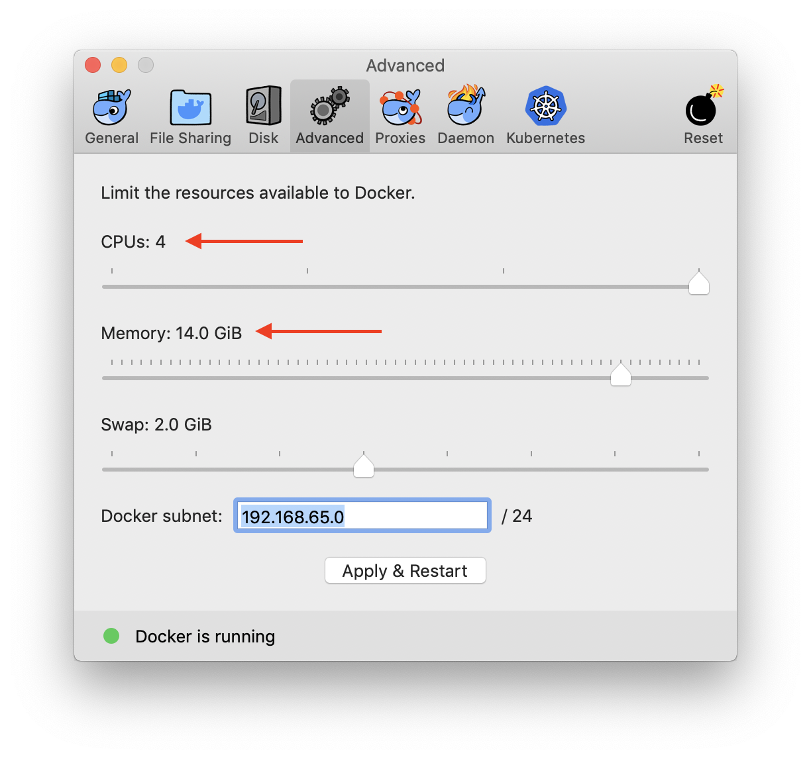


### Windows

1\. To install Docker,

For Windows 10 Pro (with HyperV) download to the package - [Docker for Windows](https://download.docker.com/win/stable/Docker%20for%20Windows%20Installer.exe)

For other versions of Windows, the older toolbox version that uses VirtualBox will need to be installed which is available [here](https://download.docker.com/win/stable/DockerToolbox.exe)

 * go to folder where the installation file (Installer.exe) is saved and run (double-click) the installation file. 
 * click the installer link to download.
 * follow the install wizard to accept the license, authorize the installer, and proceed with the install.
 * when it completes, the installer reports it was successful:
 * click the finish button to complete the installation. 
 

2\.  To start Docker,
* search for Docker, select the app in the search results, and click it (or hit Return).
 
* when the whale in the status bar stays steady, Docker is up-and-running, and accessible from any terminal window.
 


* if the whale is hidden in the Notifications area, click the up arrow on the taskbar to show it. To learn more, see [Docker Settings](https://docs.docker.com/docker-for-windows/#docker-settings).
* If you just installed the app, you also get a popup success message with suggested next steps, and a link to this documentation. 
 


3\. By default, Docker for Windows limit the memory usage to 2 GB. Given that most Bioinformatics workflows are computationally intensive, some of the tasks may require a higher memory usage. To change the memory allocation, go to `Docker Preferences (Right Click on the docker Icon) -> Preferences -> Advanced`, and adjust the memory allocation as needed. We recommend allowing Docker engine to use at least 10 Gb of memory or more. 

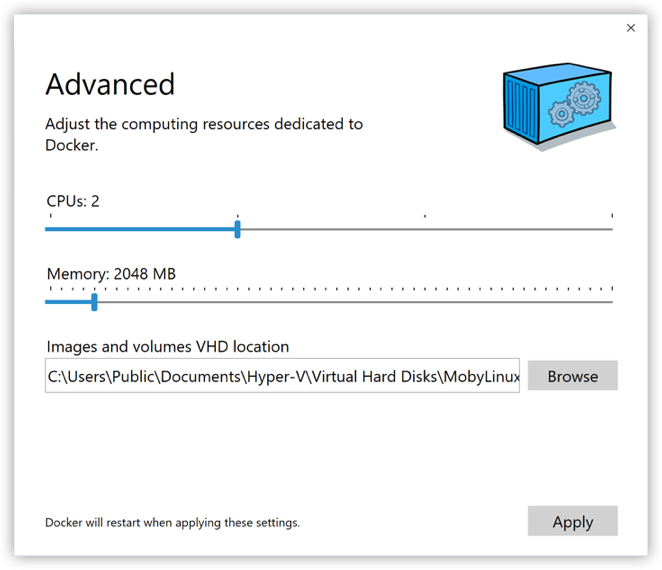

4\. For those using the Docker version that uses VirtualBox start the Docker application as an Administrator. To adjust the available memory, the user must launch Oracle VirtualBox, stop the Virtual machine and adjust the Systems settings to give the machine more RAM. The default is just 1 GB.

### On The Cloud

On the cloud, BwB can also be run on any cloud instance. Please refer to the Linux and Windows instructions to install Docker on the cloud instance.


#### Amazon AWS

1\.  Login to your console and create a new EC2 instance of ubuntu (Here we are using ubuntu you can choose operating system of your choice)

2\.  Select the configuration and click on "Review and Launch"

3\.  You will be prompted to associate a ssh key pair with the instance, you can use an existing key pair or create a new one. The key will be downloaded onto the computer  which will be later used to ssh into the machine.
 

4\.  Once the instance is running select your instance and scroll right for security groups.

5\.  From "Actions" button select "Edit inbound rules" 

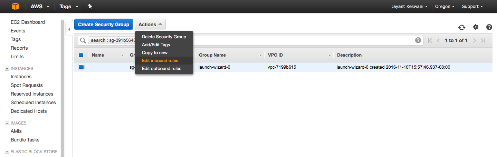 

6\.  Add a new http rule for port 6080 to access the GUI from the container

 

7\.  Copy the public dns of the instance 

 

8\.  SSH into the instance by typing the following command into the terminal. 
(Type the commands in the directory where the ssh key of AWS instance was downloaded)
```bash
 #(demo.pem is name of the key)
 chmod 400 demo.pem 	`
 ssh -i demo.pem ubuntu@public-dns-of-aws-instance
```
9\.  After you are logged use the instructions [here](#DockerInstall) to install Docker on Linux.

10\. Configure the firewall using the instructions here [http://docs.aws.amazon.com/AWSEC2/latest/UserGuide/authorizing-access-to-an-instance.html](http://docs.aws.amazon.com/AWSEC2/latest/UserGuide/authorizing-access-to-an-instance.html) 


## Starting Bwb

After you have installed Docker on your machine, you are now ready to start your Bwb session to create and execute Docker container workflows. Bwb comes inside its own Docker container so it is first necessary to launch Docker as shown in the previous sections depending on which platform is being used.

Then run the following commands on command prompt / terminal. 
1\.  Download the docker image containing Bwb. 

```bash
docker pull biodepot/bwb:latest
```
 

Alternatively, you can build the image from the GitHub repo:

On Linux and Macs
```bash
git clone https://github.com/BioDepot/BioDepot-workflow-builder.git
cd BioDepot-workflow-builder
docker build -t bwb/biodepot:latest .
```
On Windows (using Git for Windows)

Right click on the git bash icon and choose to run as an administrator
```bash
git config --system core.longpaths true
git clone https://github.com/BioDepot/BioDepot-workflow-builder.git
cd BioDepot-workflow-builder
docker build -t bwb/biodepot:latest .
``` 
2\.  Start the Bwb container 

```bash
docker run --rm -p 6080:6080 -v $PWD:/data -v /var/run/docker.sock:/var/run/docker.sock -v /tmp/.X11-unix:/tmp/.X11-unix  --privileged --group-add root biodepot/bwb
```

This command will launch a mini-webserver and start a windowing environment inside the container. The Bwb application is automatically launched upon running the container and appears as a maximized window on the Desktop inside the container. In the above command we have set the port to be 6080 and the current directory is mapped to the /data directory inside the container. However, all this is hidden from view until the user connects to the container using a browser. 

To access the container open up a browser window and type in the IP of the container and port that it is listening to into the address bar. For a local installation using Linux, the IP of the container is localhost or 127.0.0.1 so the user would type localhost:6080 into the address bar of the browser. For a remote installation, the ip is the ip of the server.
<a name="findip"></a>

For Macs and Windows machines using VirtualBox, the local ip is usually [192:168:99:100](http://192:168:99:100:6080) but if that does not work you can find the IP with the following command in a terminal if using Linux/MacOS or in the Docker window if using Windows.

```bash
docker ps
```

More information about finding Docker IP is available here: [https://docs.docker.com/machine/reference/ip](https://docs.docker.com/machine/reference/ip/)

## The Bwb/fluxbox work environment

### Graphics support for containerized apps

The Bwb no-vnc container launches a mini-webserver that is accessed using your browser. The server uses fluxbox [http://fluxbox.org/], a compact windows manager to provide a graphical user interface similar to Windows or the MacOS. Fluxbox provides full graphical support using X11 to render the graphics internally on the server.  Bwb uses the GUIdock-X11 system to allow containerized apps (i.e Jupyter, gnumeric)  to export graphic output to the server's internal screen.  The noVNC protocol is then used to transfer the internally rendered screen to your browser and HTML5 commands draw the graphics on your browser.


### Basic window manipulations

 The Bwb application is started automatically upon starting the Docker container. The window can be minimized, maximized/restore and closed using the buttons in the left hand corner. These are the same buttons available in standard Windows, MacOS and Linux windowing systems. The window can also be resized by clcking on the middle button to unmaximize and then dragging the lower right hand corner.

Clicking on the left minimize button of th window hides the window and reveals the background. The window can be restored by clicking on the panels in the lower toolbar. Clicking on the right close button closes the application. It, however, does not quit the container.

### Application menu

If we minimize or close the window we will see the background screen. Right clicking on the background brings up an application menu. For the basic Bwb container, there are 3 menu options, the Bwb app, a terminal to enter system commands, and the quit container option.

### Multiple Bwb instances and workspaces

You can launch multiple instances of Bwb which will appear in separate windows.  There are 4 separate workspaces that are available which act as independent screens. Clicking on the panel at the left of the bottom toolbar switches between the workspaces. Cut and paste is supported between different windows within the browser window (i.e originating from the container).

### Interaction with host windowing system

Note that the fluxbox windowing system is inside the browser window. You still have access to whatever windowing system you are using on your host machine. If your browser closes or go to another url, nothing happens to Bwb - the browser merely provides a viewport to the server in Bwb container . Refreshing or reconnecting the browser to the container IP allows you to interact with Bwb again. Only by using the quit option from the fluxbox application menu or by using Docker to terminate the container can you actually quit.  Cut and paste is not yet available from windows in the user's host machine to windows in the browser, though this feature will be added soon. 


## Bwb application

### Bwb window with kallisto-sleuth-jupyter workflow showing main features
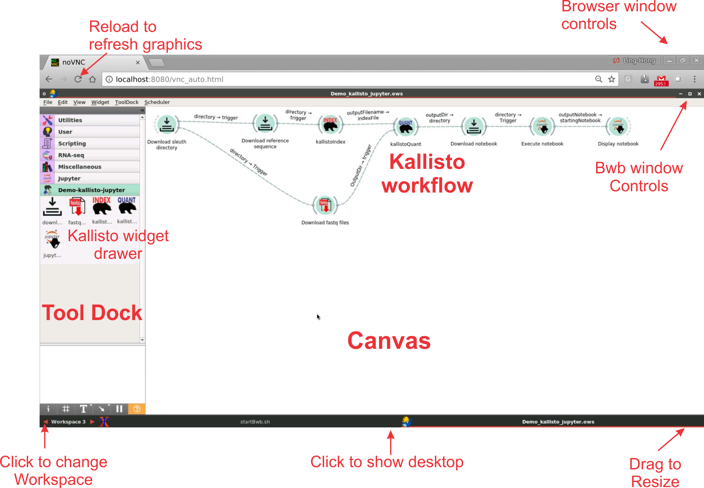

### Bwb fluxbox desktop with Bwb minimized
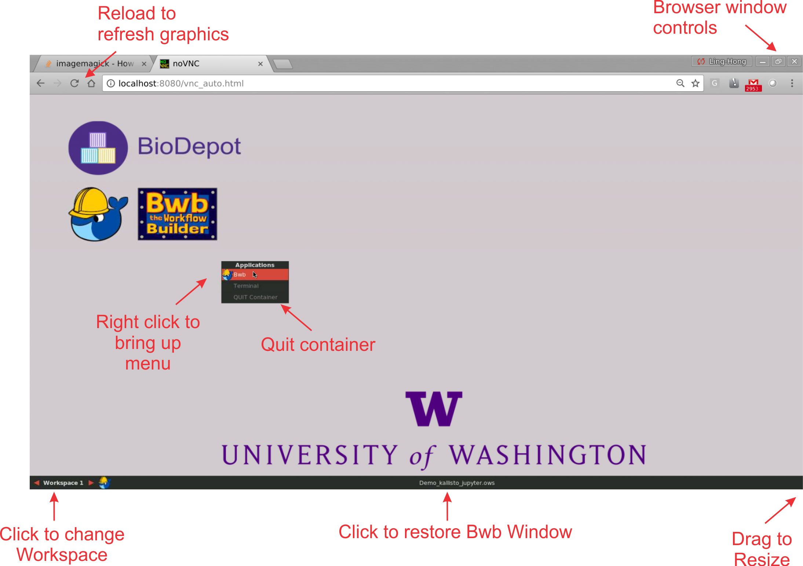

### Overview

Bioinformatics analytical pipelines are comprised of multiple modules. The output from one module becomes the input processed by the next module in the pipeline. Scripting languages such as Python, R, Perl, and bash are used to connect workflows and to generate the final output, often in the form of tables and graphcs.

In Bwb, we use Bwb workflows and widgets to represent and execute analytical pipelines. Each execution module in a pipeline is represented by a graphical icon which we call a widget.  Output from one widget can be connected to the input of the next to form a graphical flowchart representing the analytical pipeline which can be saved or executed. A Bwb workflow representing a pipeline, thus consists of a set of widgets (individual execution modules) and a file that defines how their inputs and outputs are connected. Construction of Bwb workflows is accomplished by constructing, and connecting widgets using the Bwb interface described in the next sections

### Tool Dock

When Bwb is started, the Bwb application window pops up. On the left hand side of the application window is tool box (tool dock) with multiple tabs  (drawers) which contain different collections of widgets. Clicking on the tab expands the toolbox drawer to reveal the contents. Drawers are organized by function. Bwb comes with a set of ready-to-use widgets. These are all linked to containers available on our BioDepot repositiory on Docker hub. Any workflows constructed with these widgets will automatically download the necessary containers the first time that they are run and require no installation. 

Users can also create their own drawers. A new drawer is created whenever a workflow is loaded. Also widgets can be added (and removed) using the ToolDock editor available fromt the menu bar. (See the section on editing the tool dock

Note that different drawers in the Tool dock can have widgets with the same name. For the included stock widgets, these are identical. However, they can represent different versions due to the ease which widgets an be customized. For user workflows we use different color to visually distinguish these customized widgets from stock widgets.

The Tool Dock can be minimized using the button on the top right hand side.

A miniature version of the tooldock is accessible by right clicking in the canvas section to the right of the toolBox 

### Editing the Tool dock

Widgets and drawers can be added and deleted from the Tool Dock by choosing the edit tool dock item from the menu. Before any of the changes are reflected, the user must also choose to refresh the settings.

### Interacting with widgets

To interact with a widget, it is first dragged from the Tool Dock onto the canvas. Clicking on a widget brings up the widget UI window with tabs for parameter entry, an output console and a tool bar with options to control the execution of the widget. Right-clicking on the widget and choosing the edit widget item brings up the widget definition window. The definition window contains a set of forms that define the parameters to be queried by the UI window, the Docker container to be used, and the commands to be run upon execution. Finally dragging the mouse from the edge of one widget to another creates a link between the output of one widget to the input of the second widget. These three sets of actions are described in the next sections

#### Widget user interaction window 

The Bwb interaction window pops up when when a widget is double clicked. There are up to 3 tabs in each window: Required entries, optional entries and console. 

##### Required parameters screen
Required entries are parameters that must be entered before the widget can execute. An example would be fastq files for an alignment widget. 
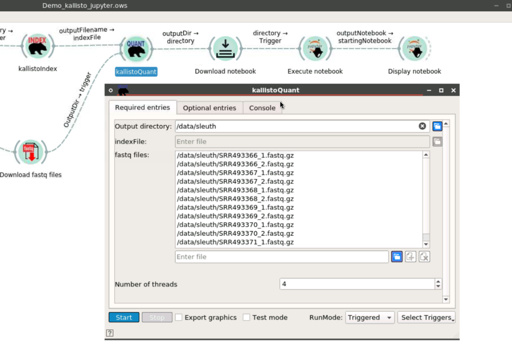


##### Optional parameters screen
Additional optional entries are optional flags and parameters that are not required for program execution. When these are present, they are displayed by clicking on the optional entires tab. 
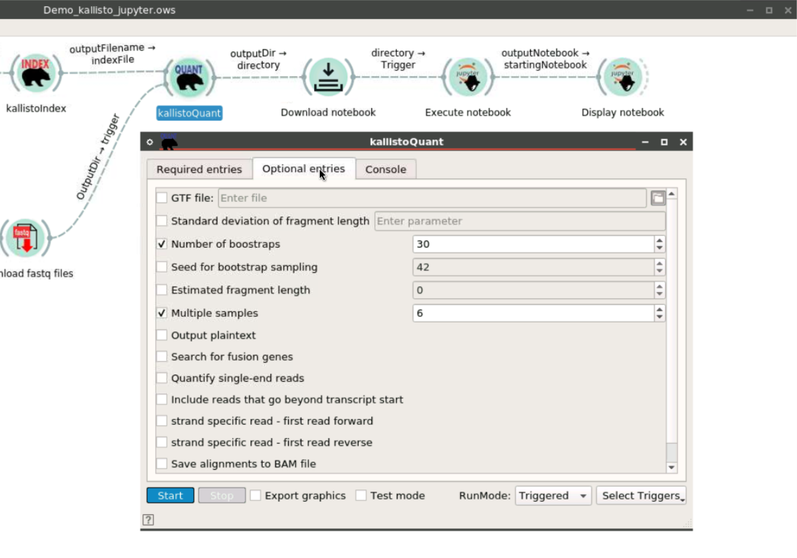

##### Console screen
Finally, clicking on the console tab brings up a window with the text output from the widget. This is useful for monitoring the progress of a widget and for debugging.
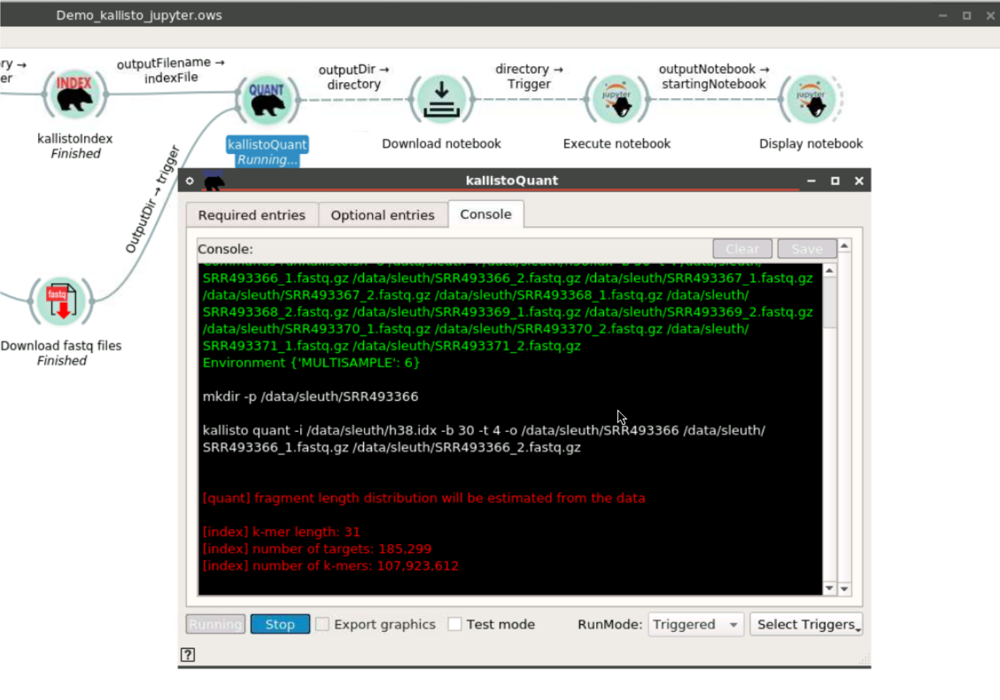

##### Execution bar
At the bottom of the UI window are a series of controls that affect the execution of the widget. 
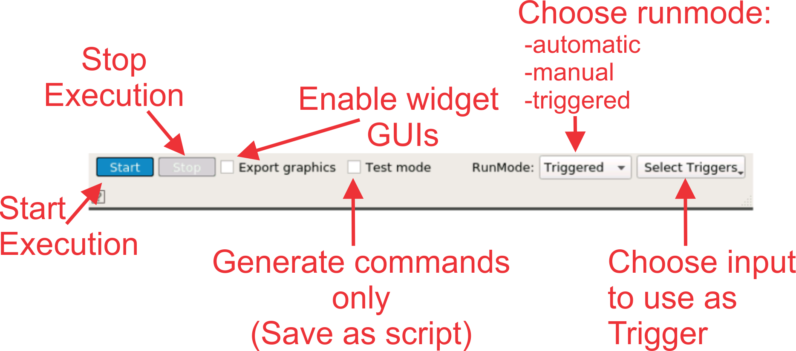

###### Start
The start button starts the execution.
###### Stop 
The stop button then becomes active and pressing it will terminate execution.
###### Export graphics 
The export graphics box, if checked allows the widget to output interactive graphics to the Bwb screen. This is necessary for applications such as Jupyter and Cytoscape that have their own GUI.
###### Test mode
The test mode box, if checked runs the widget and downstream widgets in test mode. In test mode, upon pressing the start button, the docker  commands are not executed but are generated and recorded in console windows. An option will also appear to allow the user to save the commands to an executable bash script that can be run without Bwb.
###### Run mode
The runmode menu controls how the widget will be executed. In manual mode, the default option, the widget can only be run by the user pressing the start button. Automatic mode meanst that the widget will run without user input, once all the required options are entered. The last run mode is the triggered run mode. The widget will start execution after one or more inputs are received *AND* all the required parameters are set. Manual start mode is typically used for widgets at the beginning of pipelines or in optional sections of the pipeline. Triggered mode is typcially used in downstream widgets to allow widgets to sequentially process the data as it flows through the analytical pipeline.
###### Select triggers
The Select triggers menu  allows the user to specify which inputs will trigger execution. If more than one input is chosen, the widget will wait until all inputs are received before executing. This menu is only active if the Triggered runmode is chosen


#### Widget definition window

Right clicking on the widget brings up the option to edit its definition parameters. Choosing the edit option edits the present widget. Choosing the new option edits a new widget. The same options are also available from the main menu. Upon entering the edit widget mode, a window pops up with multiple tabs described next:

##### General tab
The general tab allows the user to enter general information about the widget. 
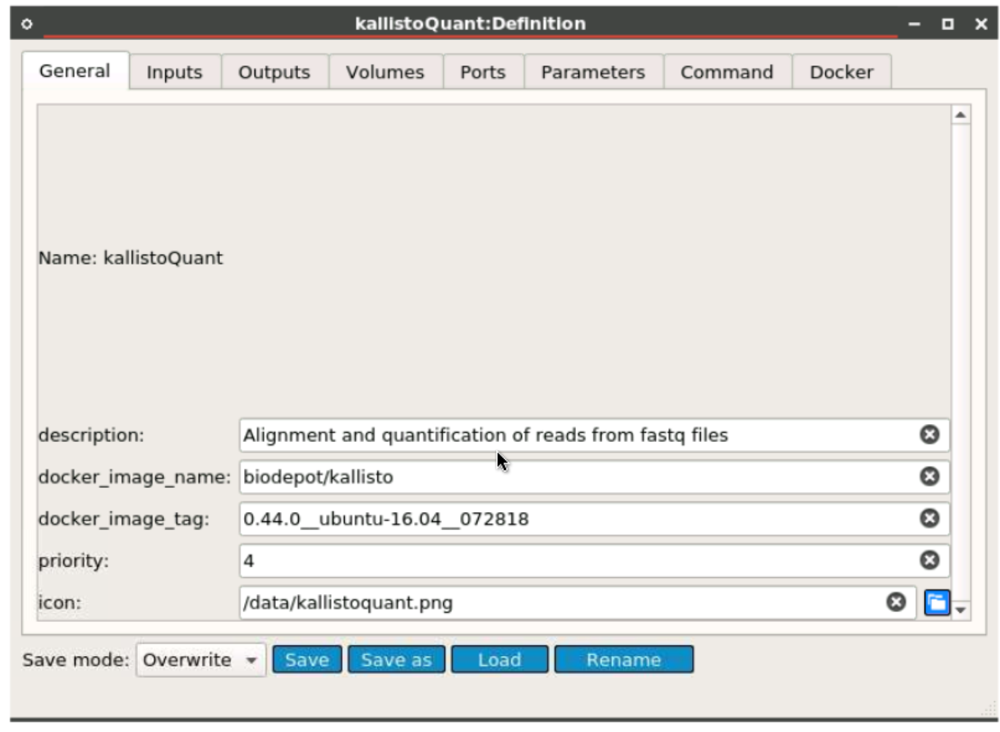

The entries are:
###### description
A description of the widgets function. When the user mouses over a widget in the Tool Dock, this text will appear in the help box below the Tool Dock.
###### docker_image_name
The name of the Docker container that is used. 
###### docker image tag
The image tag for the Docker container. The default tag for any conainer is latest which is not necessarily the most recent in spite of the name. Bwb has the version of software and the major dependencies and the date separated by underscores to proivde a detailed yet human readable versioning tag
###### priority
Determines the order of appearance in the Tool Dock drawer
###### icon
The icon used for the widget

##### Inputs tab
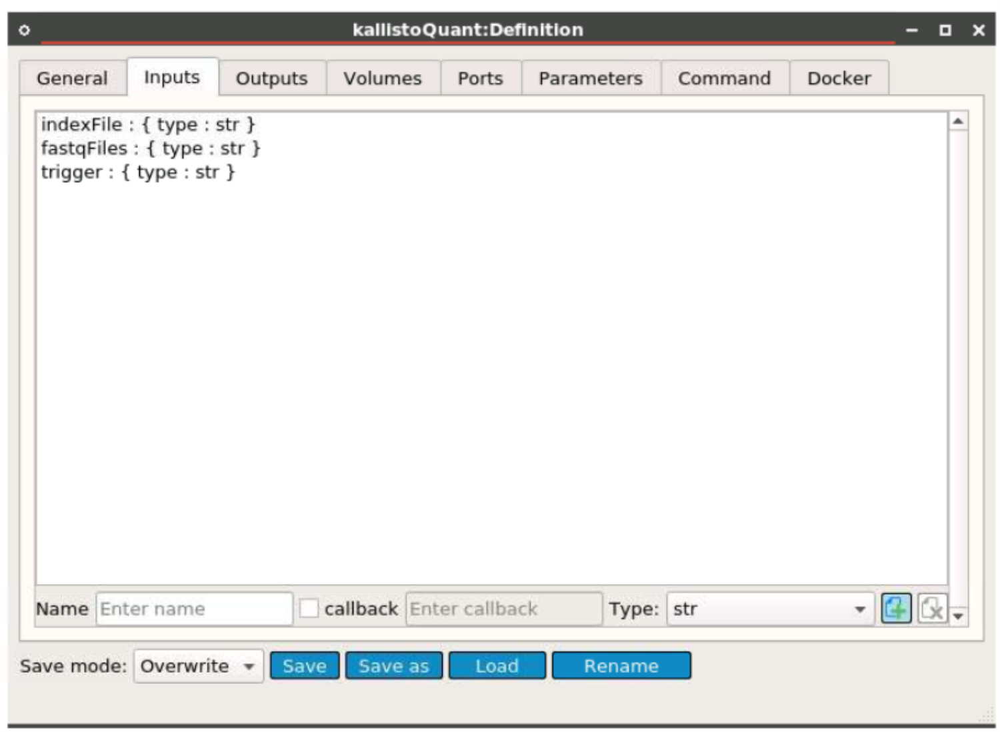
The input section allows the user to specify the name of the inputs accepted by the widget. These are variable names that can also be assigned to parameters and outputs. Currently the callback option is not used. When an input name is also a parameter name, the value of the parameter will be determined by the input if it is connected to the output of another widget

##### Outputs tab
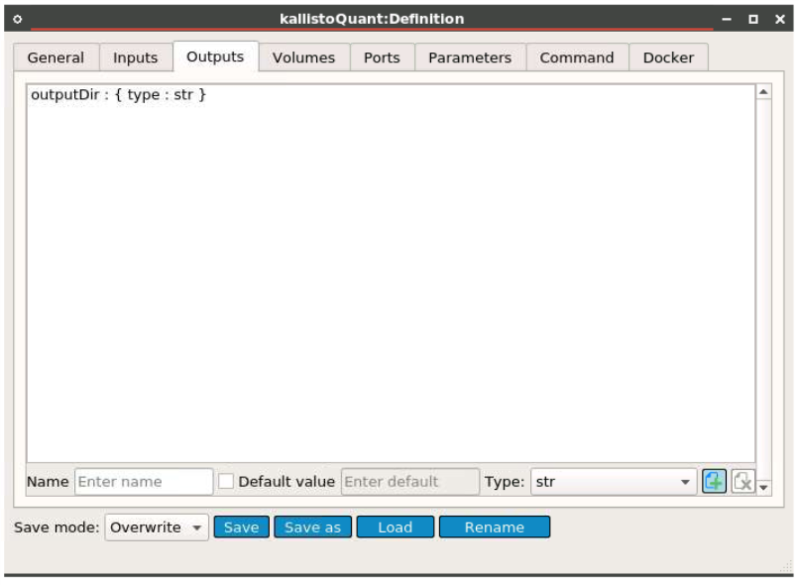
The output section allows the user to specify the names of outputs that will be sent when the widget is finished execution.

##### Volumes tab
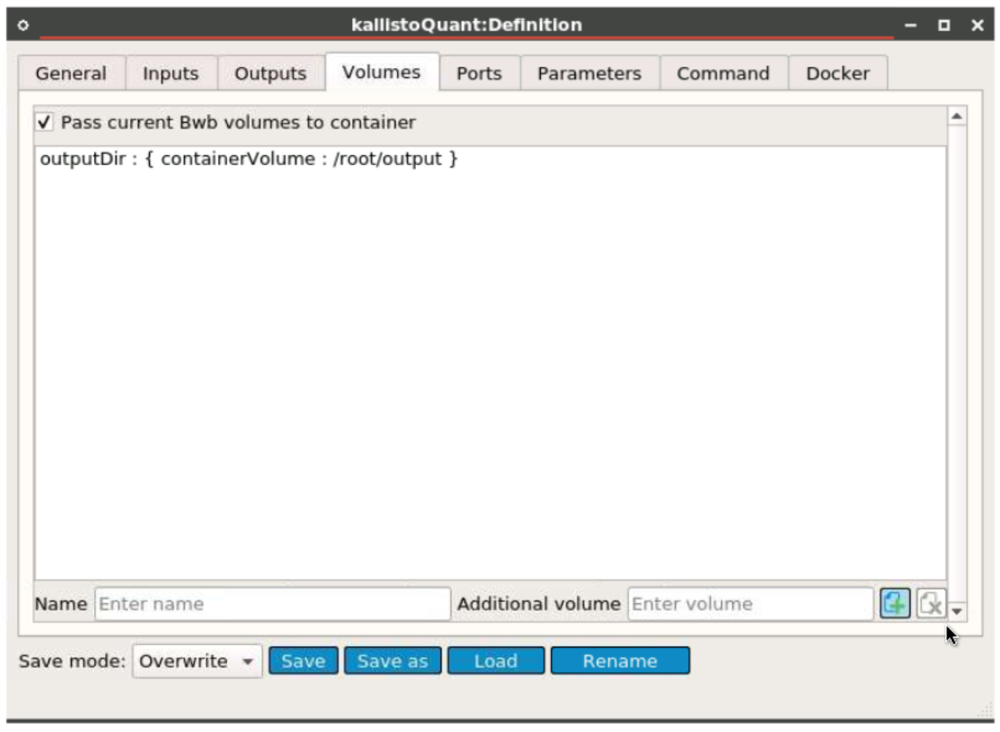
Volumes allow the user to map a user volume to a container volume. This allows the workflows to operate on data that is on the host system. The Bwb container already has one mapped volume and by default this is passed to the workflow containers. For example, the default mapping is that the current host directory where Bwb is launched is accessed through the /data mountpoint in the Bwb container. By default, all workflow containers will also be able to access the host directory through the /data mountpoint.

The volumes tab allows the user to enter a variable name and an internal container volume or mount point. The user is then queried (using the parameters section) for the local directory that is to be mapped to the internal container volume.

##### Ports tab
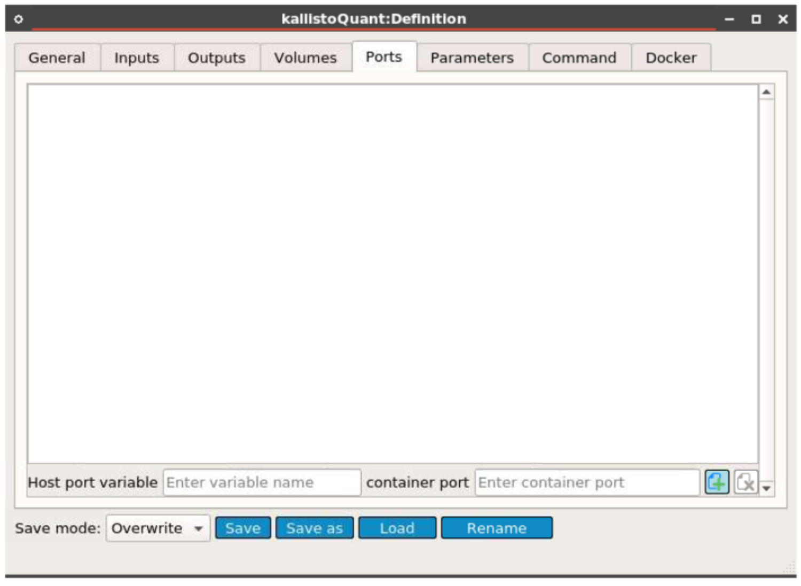
Similar to the volumes tab except the widget can query a host port to map to an internal port. 

##### Parameters tab
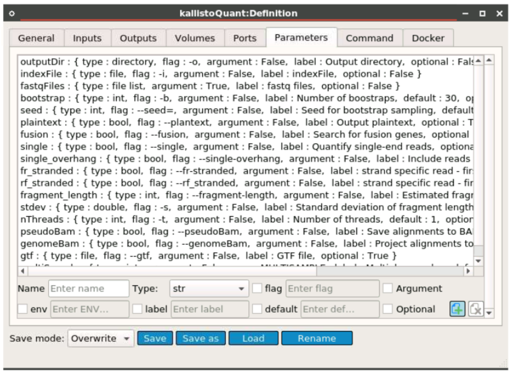
Different flags and environment variables to be queried an be entered in this section. The name box is the internal variable name. This can also  be an output, input, volume, or port variable defined in previous section that the widget wants the user to input. The type of the variable determines the manner of entry. For example, a file type will bring up a line for manual entry and a button to browse for files. A boolean type will bring up a check box in the UI window. There is an optional flag field. This can be a single -, -- or any string that appears before the value that is entered. The variable can be an argument with no flag. Arguments and flags are passed in the command line. The value can also be passed to the container as an environment variable as well. The entry of a value for the variable can be optional.

Individual parameters are entered using the + button. This will add the parameter to the box where they can be dragged to change the order, deleted using the x button, or edited.

##### Command tab
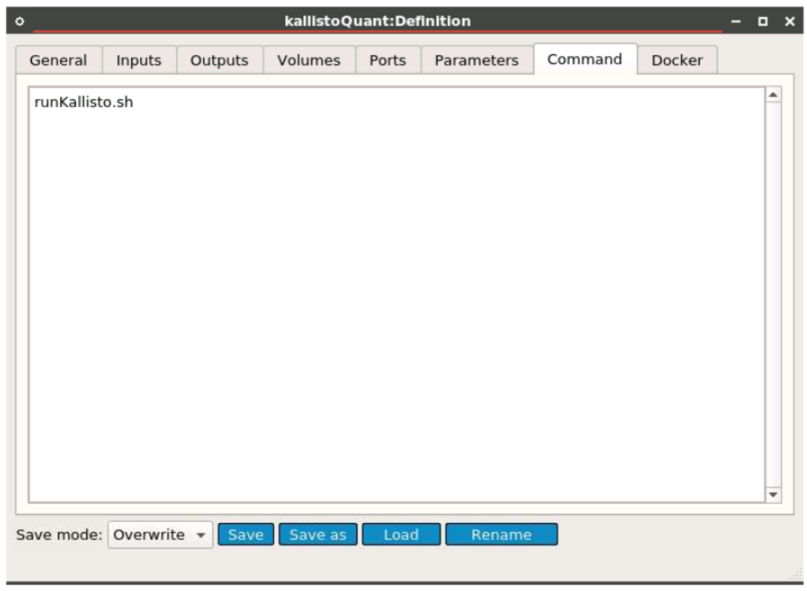
The command is the command that is executed upon in the docker container. A command will be followed by the flags and arguments specified in the parameters section in order from top to bottom. Arguments always appear at the end of the command. It is also possible to specify a specific order using the _bwb{<variable>} notation. Multiple lines are possible - these are joined by the && operator to form a single command (in bash...)

For example the command
```
rm -f Counts/*
Rscript Programs/analyze.R _bwb{ConfigurationFile}

```
will generate the following command
```
	rm -f Counts/* && Rscript Programs/analyze.R <ConfigurationFile> <flags> <arguments>
```
##### Docker tab
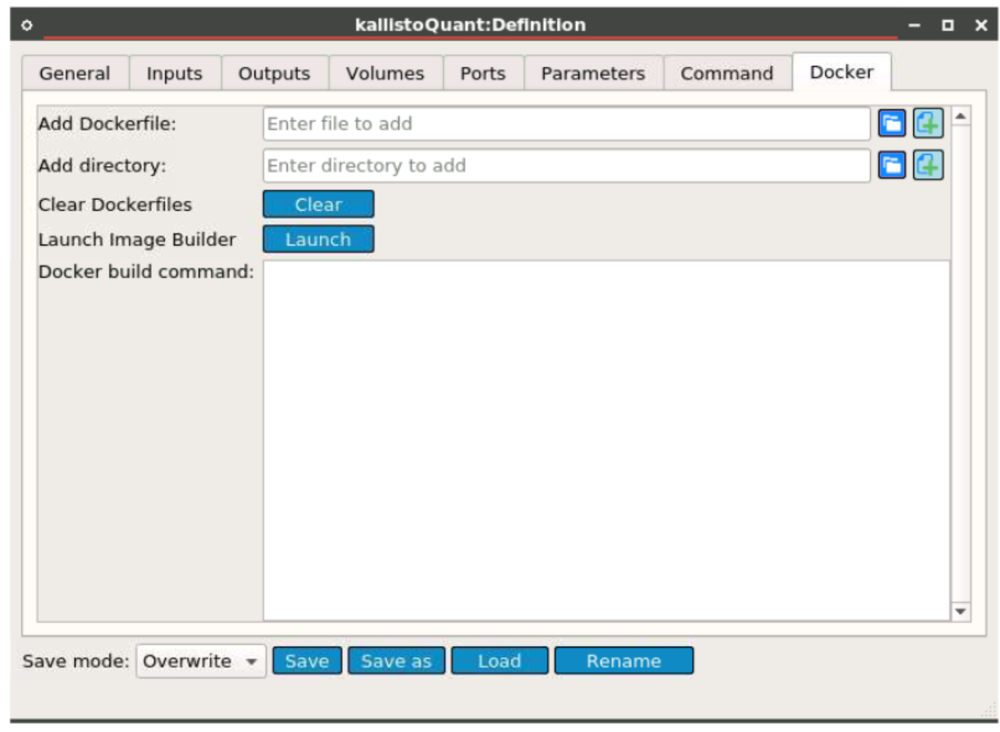
The Docker tab contains information about the Dockerfiles and build commands used to construct the container. This currently is mainly for documenting the provenance of the container. However, we will be adding the option of generating the containers from this section rather than downloading the container from a repo. 

Currently buttons exist to copy a Dockerfile to the widget directory (Add Dockerfile), delete Dockerfiles (Clear).
There is also a button to bring up the BiocImageBuilder utility which facilitates the building of Docker containers.

##### Widget definition save options and further customization by editing the .py file
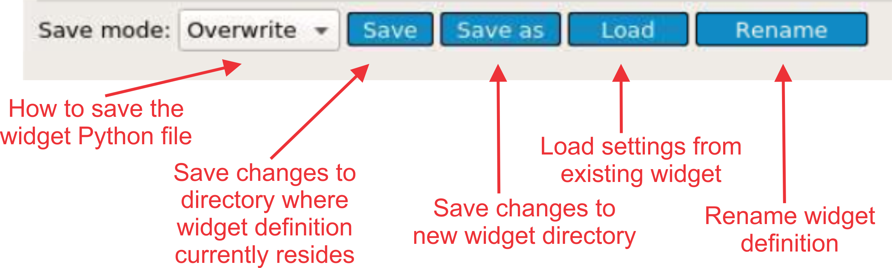

At the bottom of the window are the save options. To understand the save options, let's first explain the files gernerated by the Bwb widget builder after saving the definition. The files generated for widget mywidget are
```
mywidget/mywidget.attr
mywidget/mywidget.states
mywidget/mywidget.json
mywidget/mywdiget.py

```
mywidget.attr is a json file saves the variables entered into the definition window.
mywidget.states  is a json file saves the actual state of the form so that when the defintion window is opened again, the user can resume whre he or she left off.
mywidget.json is a json file that stores the variables which are actually read in by the UI window and is derived from the attr and states file.
mywidget.py is the code that is executed to implement the widget and reads in mywidget.json file to display the UI window and execute the command in the docker container when the form is filled. Note that the values for the form are not stored with the widget but with the workflow .ows file described later.

Originally in the OrangeML setup, the mywidget.py code was written manually. Most of the boilerplate code has been automated using the mywidget.json file and type based form based interfaces. The input and output control routines have also been automated but this is an area where some customized code maybe required, for example to process internal variables into a form that will be output.  

To accommodate custom code, there are 3 save options. 
###### Save mode: Overwrite 
Overwrites the existing python file with the newly generated one. This is used when there is no customized code
###### Save mode: Merge
Will only overwrite the boilerplate code for reading values from the json file (the first 80% of the code). Any code that appears after this first part of the script is untouched.
###### Save mode: Data
Will not touch the python file. Will only generate the json files

Finally in addition to the save and save as button there is an additional load button.
###### Load button
Will load the attrs and state from another widget - this allows the user to use a pre-existing widget as a template or starting point

### Building workflows from widgets

#### TLDR;

A quick summary of the steps to construct a workflow:

1\. Drag desired widgets from Tool Dock onto the canvas

2\. Save the workflow and check of merge all widgets box

3\. Load the saved workflow and a drawer of workflow widgets will appear in the Tool dock

4\. Edit the widget definitions to define which parameters will be queried, what command and which container will be run

5\. Connect the widgets by dragging from the right side of the widget (output) to the left side of the next widget to form the pipeline

6\. Enter all the values for the different parameters

7\. Save the workflow

#### Workflow structure

The workflow is stored in a single directory. This directory contains widgets specific to the workflow, the icon, and a stub \__init__.py  python script used to load the workflow into Bwb. A .ows file saves the connections between the widgets and all the parameter values or settings in xml format. This is different information than the json files for each of the widgets which store information defining which parameters are queried and what and how the widgets execute based on these parameters but not the values of the parameters themselves. Workflows can also use widgets that are not stored locally in the directory. This can be useful for building and prototyping new workflows or when the workflow is meant to be a dependent version to be automatically updated as widgets get changed in other workflows. Upon saving, there is the option of merging all widgets. This will make copies of all widgets outside the workflow, resolve any names that are identical and update the ows and other files. All widgets will then appear in a separate Tool Dock drawer when the workflow is loaded.

We recommend that for most cases that you merge all widgets that are to be used before modifying them in a workflow for maximum encapsulation and reproducibility
**
N.B. changes to widgets and workflows may not be reflected immediately as Bwb must reload in order to incorporate new or changed routines. This is done as much as possible automatically but if it does not, using the reset settings option from the File menu or the Load workflow option to reload the workflow **

#### Connecting widgets
Widgets are connected by dragging from the right side of the source widget to the left side of the destination widget. This transfers the output of the source widget to the destination widget. When there are more than one possible connection, Bwb will choose one. Double clicking on the link will allow the user to edit this choice and select which inputs are to be connected to which output. An output can be connected to multiple inputs but inputs in Bwb by default currently accept one output. This may be changed in the future - especially for triggers

##### Input from connections override user input
When an input is connected to an output - the output value will become the input value and will override any user input and the form for that imput will be grayed out and inaccessible.

##### Connections to triggers are used to control the execution of widgets
One of the major uses of connections is to control the execution of widgets in workflows. A widget that has one or more inputs that are connected can use these as execution triggers using the run mode at the bottom of the destination widget. The widget will not execute until all required parameters are entered and all the inputs that are triggers receive input. This allows for a widget to wait until another widget has finished processing. For example, the kallisto quant widget in the kallisto-sleuth demo workflow is triggered by the indexFile produced by the kallisto index widget and the output of the fastq download widget. It will wait unti the index file is ready and the fastq files are downloaded before proceeding

#### Saving workflows
The 'Save workflow as' option under the File menu will bring up a dialog box. The dialog box will ask for the workflow name which will also be the name of the directory where the widgets and other workflow files are stored. The parent directory where the workflow directory will reside also needs to be inputted. Optionally, a color and icon can provided. Otherwise, the current icon and color of the workflow are used, or in the case of new workflows, default icons and color will be used. Finally, there is a check box to merge all widgets. If this is left unchecked, the workflow will not maintain a separate copy of the widgets in its directory. The workflow will function but will use off-the-shelf widgets provided by Bwb or another loaded workflow. Checking the box clones all the widgets into the workflow directory. Note that different drawers can carry its own version of a widget. These will be assigned different names if there is a conflict before being copied into the workflow.

#### Loading and executing a workflow
To load a workflow go to the File menu at the top left corner of the Bwb window and choose the 'Load workflow' option. A file dialog will pop up allowing you to chooe the workflow to load. The workflow is a directory.

Demo workflows that come with Bwb are in the /workflows directory.

To execute a workflow, double click on a widget and manual start from that widget by hitting the blue start button. When that widget is finished execution it will send output to connected widgets. If these widgets are triggered by the output, they will then execute (as long as all the required parameters and other other trigger signals have been received. Workflows also can be started from any widget if the required files and parameters are present. For example,  an alignment pipeline can skip the indexing steps if the index has already been generated or downloaded.

#### Testing and exporting workflows as a bash script 
A test mode is also provided for testing. Checking the test mode box before hitting the start button causes the widget and downstream connected widgets to output the docker commands to the console rather than executing them. This allows the user to check whether the triggers are set and the necessary parameters are entered without needing to run a lengthy workflow. In addition, the user will be prompted for a file to save the docker commands as a bash script. The script is a record of the actual docker commands that are run when the workflow is executed. 

The bash script is portalbe and can be run without Bwb with 3 caveats:

1\. It may be necessary to give the save file run permissions. 

2\. The file paths are those of the host system - if the script is run elsewhere these will need to be altered

3\. The graphics are set to screen1 which is used by Bwb. Bwb must be active for graphics support, in which case the graphics will appear inside Bwb even if the script is run on the host. Alternatively, the user can change the command to use screen0 and follow the recipes given in our GuiDock-X11 paper.

## Demo workflows

Four demo workflows are included with the Bwb container. They are found in the */workflows* directory

### DToxS demo
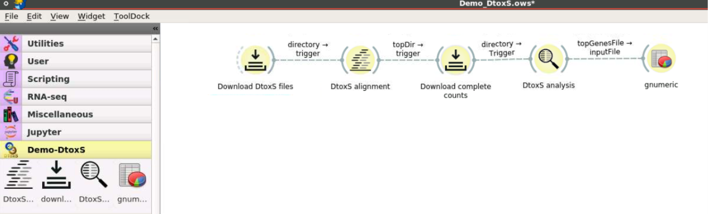
This is an workflow used for processing UMI (Unique Molecular Identifier) barcoded RNA-seq data. This is one of the first workflows that we converted for Bwb. The first downloadURL widget downloads the fastq files, directories and support files needed for the workflow. Upon completion it signals the DetoxS alignment widget. This widget calls bwa using a bash script and two python scripts. These are the original scripts used by DToxS. The alignment on full files would take overnight to run so our sample files are shortened versions of the true reads. However, the short files are too short to give any detectable differential expression in the subsequent steps. Therefore, in this demo, we have a second downloadURL widget which downloads the SAM files produced by bwa on the complete files. These are fed to the DtoX analyses which consists of a series of R scripts that use the edgeR package to identify differentially expressed genes. The top40 most confidently predicted differentially expressed genes are then displayed by gnumeric, an open-source spreadsheet program. 

### kallisto-sleuth demo
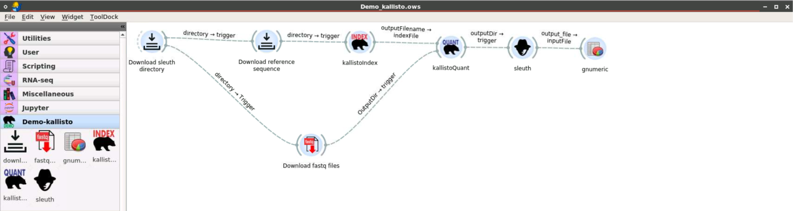
This workflow is a popular RNA-seq workflow using kallisto to pseudo-align the reads and sleuth to determine which transcripts are differentially expressed. The workflow starts with a downloadURL widget that downloads the necessary directory structure and files that are used by sleuth to translate the transcript names to gene names and a file that describes which data are in the control group and which data are from the treatment group. Upon completion, the widget then signals a second downloadURL widget to download the human genomic sequence that will be used by the kallisto index to create the indices need for alignment. The first widget also signals the fastqDump widget to download 6 paired-end reads in 12 fastq files. These are the data obtained from 6 samples that will be analysed. The widget is set to only download the first 10000 spots to allow the demo to complete in a few minutes. The kallisto align widget is triggered when both kallisto index and fastqDump are finished, i.e. it will start running after the index is made and the files are downloaded. kallisto-widget is a bash wrapper around the kallisto pseudo-alignment program. The bash wrapper sends multiple pairs of paired-end reads to the kallisto pseudo-alignment executable. kallisto then produces a series of directories that contain estimates of the abundance of the reads at each transcript. Sleuth is a R script that uses a model based on the observed abundances to determine whether a gene is differentially expressed and obtains a p-value. The sleuth widget itself is a bash script which generates an R script that calls sleuth with the parameters given by the user. The resulting p-values are then output to a file which is read by gnumeric, an open-source spreadsheet, that is displays the results to the screen.

### kallisto-sleuth with Jupyter demo
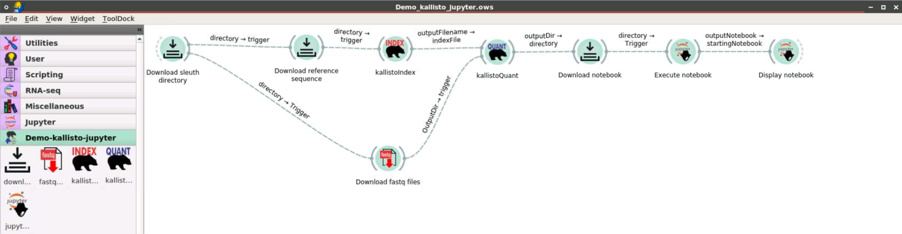

[Accompanying video link](https://www.youtube.com/watch?v=jtu-jCU2DU0) https://www.youtube.com/watch?v=jtu-jCU2DU0

The kallisto-sleuth workflow with Jupyter demo is identical to the kallisto-sleuth workflow except that instead of wrapping sleuth in a bash script and outputting the results using gnumeric - a Jupyter notebook is used to run and display the results. The first notebook widget runs nbconvert which runs the code in the notebook and generates a filled notebook with the results, including a graph of the expression of the top differentially expressed gene. This widget triggers a second jupyter widget which opens the filled notebook. The second widget is run in a container with firefox which automatically opens the notebook at the end of the workflow. The user is free to interact with the code to change the analyses or conduct further analyses using the filled notebook as it is a fully functional dynamic instance of Jupyter.

### STAR demo
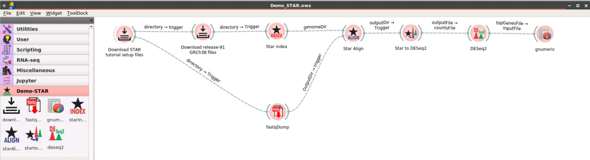
STAR aligner is another popular RNA-seq aligner. Here we have paired it with DESEQ2 to perform the differential analyses. The pipeline is very similar in structure to the kallisto-sleuth pipeline. A downloadURL widget downloads the directory structure which then signals the download of the human genome and the calculation of indices. The fastqDump widget downloads the fastq files. STAR align waits for the downloads to complete and the index to be formed. Like Kallisto, this is wrapped in a bash script to allow STAR to run on multiple pairs of pair-end reads. A small widget runs a bash script then rearranges the output columns into a form that DESEQ2 can read. DESEQ2 is R based and like the sleuth widget uses a bash script to pre-process the parameters and construct a R script. Gnumeric displays the final output as in the kallisto-sleuth demo.

## Tutorial - Adding a Python script to a Bwb workflow

[Link to accompanying video](https://www.youtube.com/watch?v=r_03_UG1mBg&feature=youtu.be) https://www.youtube.com/watch?v=r_03_UG1mBg&feature=youtu.be

The aims of this workflow are to demonstrate how to build a widget for a custom Python script and modify and customize an existing workflow. In this tutorial we will write a script to call cutadapt ( a Python app for removing adapters from reads) and insert it into the kallisto-jupyter demo workflow to trim the reads before alignment.


### Overview

The basic steps will be to

1\. Add the Python2 widget to the kallisto-jupyter workflow

2\. Customize the Python2 widget to query the additional parameters needed by the cutadapt script

3\. Create Docker image

4\. Write a short custom script locally to manage multiple files

5\. Connect widget into the workflow

6\. Test and run the new workflow


### Add Python2 widget to the kallisto-sleuth-jupyter workflow

1\. From the *File *menu choose  *Load workflow*. Navigate to the* /workflows *directory Click on the Demo_kallisto_jupyter directory and hit the *Choose* button in the bottom right corner of the dialog. After a second or two, a new drawer should appear in the Tool dock and the workflow should appear on the main canvas.

2\. Click on the *Scripting* tab in the Tool dock on the left hand side of the window. A set of programming widgets will appear. 

3\. Drag the *Python2* widget on to the main Canvas. A purple *Python2* icon should appear on the canvas next to the original light green workflow

4\. Choose *Save workflow as* from the *File* menu. A *Save Workflow* file dialog should pop up.

- Change the workflow name to Demo_kallisto_jupyter_cutadapt. 
- Then click on the blue folder button next to *Workflow parent directory*. This will bring up a *Locate directory* navigation window. This should start up in your local files. Use the new folder button (third from the right in the top right corner of the navigation window) to make a new folder and label it *tutorial*. Click *Choose* in the lower right hand corner. 
- Change the color of the new Workflow to something else by clicking on the color wheel button next to the Chanbe workflow color. 
- Check the *Merge all widget types' checkbox. This will clone the *Python2* widget and the original *kallisto *widgets and put them into a new workflow.
- Click OK on the Save workflow. This saves the new workflow to /data/tutorial/Demo_kallisto_Jupyter_cutadapt and loads the new workflow. 

 The new workflow widgets should appear in the Tool dock and the new cloned workflow should appear on the canvas. This will be apparent by the color change.

### Rename and customize the Python2 widget

1\. Right click on the Python2 widget. A menu should pop up. Choose the 'Edit Widget' option to bring up the Widget defintion window. Hit the rename button and change the name to cutadapt_demo. This will rename the widget definition, i.e. the base name of the widget in the drawer in the ToolDock

2\. The Python2 definition window should have 8 tabs. If the window is too narrow, not all the tabs will be visible. Either resize the window by dragging on the lower right corner or use the arrows in the top right  to scrool the content. The 'Genera'l tab should be the active one by default. Make the following changes:

**NB (do not enter quotes)**
-  description:  'Cutadapt trimming'
-  docker_image_name: 'biodepot/cutadapt-demo'
-  docker_image_tag: 1.0

The description will appear in the lower left hand help window under the Tool dock when we hover over the widget to let other users know what the widget does. The Docker image and tag fields tell the widget which container to user. We will build that container later.

3\. Click on the Inputs Tab. Under the big white text box there is a set of data entry boxes followed by an add button (file icon with plus sign) and a delete button (file icon with x sign) which should be inactive. Enter 'OutputDir' in the 'Name' box and then click on the add button. The new entry should by visible in the text box. To edit an entry if there is a mistake, click on the entry in the text box. The boxes at the bottom wil be filled with the values from the entry and can be edited and saved by clicking the add button. The delete button should become active and allow you to delete the entry.

What we have done is defined 'outputDir' as an input. This is because the fastq download widget outputs the output directory upon finishing and we want to be able to receive that signal. However we also want to be able to use that information by passing it to our script. This we do in the next step. 

4\. Click on the Parameters tab . Do the following:

- Create entry for *OutputDir* by putting *OutputDir* in the *name* text box, choosing file from the *Type* text box, checking the *flag* box, entering *-d* followed by a space, as the value, enter, Check the *label* checkbox, and enter  *fastq directory:* into the label text box. Then press the *add* button.

- Create entry for *quality* by putting *quality* in the *name* text box, choosing *int* from the *Type* box, checking the *flag* checkbox, entering *-q* followed by a space, as the value for the flag. Enter, *Mininum quality* in the label box. Enter *10* in the *default *box. Then press the *add *button

- Create entry for *minLength* by putting *minLength* in the *name* text box, choosing *int* from the *Type* box, checking the *flag* checkbox, entering *-m* followed by a space, as the value for the flag. Enter, *Mininum read length* in the label box. Enter *50* in the *default *box. Then press the *add *button

- Modify the the inputFile entry by clicking on the inputFile entry. Then at the bottom uncheck the Argument box. Check the flag box and enter a single space for the value of the flag. Click on the save button (file icon with plus sign.)

What we have done is to create three new entry forms. One for *outputDir *which is where the fastq file reside, one for the minimum quality of the reads, and one for the minimum read length. We also changed the *inputFile* entry (which is the python script) to have a blank flag instead of being an argument. Bwb will place all parameters after the command in the order which they appear in the list. However, arguments will be placed after all flags. The bare command is visible in the Command tab and is simply 'python'. 

So with our changes the widget will execute.:

```
python <blank flag><scriptName> -d <outputDir> -q <quality> -m <minLength>
```

In reality we would also have parameters for the file with adapter sequences and possiblly other flags instead of this relatively simple example

### Creating the Docker image


The Dockerfile used is:

```
#from https://github.com/frol/docker-alpine-python2/blob/master/Dockerfile - the Dockerfile used for Python2 widget
FROM alpine:3.7
RUN apk add --no-cache python && \
    python -m ensurepip && \
    rm -r /usr/lib/python*/ensurepip && \
    pip install --upgrade pip setuptools && \
    rm -r /root/.cache
    
#added these lines for cutadapt
RUN apk add --no-cache gcc gzip && \
    pip install cutadapt && \
    apk del gcc python-dev libc-dev && \
    rm -r /root/.cache

```

The widget is built starting from the Dockerfile used for the python2 widget. This widget was built using the compact alpine Linux distro which uses apk as a package manager (analogous to apt-get, yum, and dnf in other distros). We add one extra command line (the slashes concatenate the lines into a single command) which installs the gcc compiler suite and dev libraries python-dev libc-dev needed by pip to install cutadapt. The gzip library is installed as well to support decompression of gzpped fastq files. *pip* is then called to install *cutadapt* and the dev tools removed as they are not necessary to run cutadapt. The entire procedure is done in one command to avoid Docker spawning intermediate containers that are take up space in the final image.

To add this Dockerfile and build this Dockerfile:

1\. Click on the Docker tab of the Python2 definition window. This is the rightmost tab and may require scrolling to see it
. 
2\. Click on the blue folder button on  'Add Dockerfile' line and navigating to /tutorialFiles/Dockerfile. Then press the add button (rightmost button) to add the Dockerfile. A message should appear confirming that the fie has been added.

3\. Click on the blue launch button to launch the image builder. Resize it by dragging th right corner and scroll to the bottom to see the open button. 

4\.Click on the the open button. It should start in the Python2 widgets Dockerfiles directory. The Dockerfile should be there. Open the file. 

5\.Enter biodepot/cutadapt-demo:1.0 into the Image Name box and press the build button

### Save widget and load the workflow again

1\. Hit the bottom save button to save all the changes to the widget. The workflow should automatically reload to update the changes.

### Creating or copying the wrapper Python script

The wrapper script is needed to call cutadapt on different sets of paired end files. It is provided in /tutorialFiles/cutadapt_multi.py or you can paste the code into a local editor to be saved on your local file system. The code is also available from the github repository. 


The script is:
```python
import os
from glob import glob
from optparse import OptionParser

def runCutAdapt(file1,file2,flags):
    print ("cutadapt {} -o tmp/{} -p tmp/{} {} {}".format(flags,file1,file2,file1,file2))
    os.system("cutadapt {} -o tmp/{} -p tmp/{} {} {}".format(flags,file1,file2,file1,file2))

#get options - we are interested in -d for directory -q for quality -m for minimum length
parser = OptionParser()
parser.add_option("-d")
parser.add_option("-q")
parser.add_option("-m")
(options, args) = parser.parse_args()

flags ="-q {} -m {}".format(options.q,options.m)
#change directory to output directory
os.chdir(options.d)

#we use the fact that for our naming convention the paired end files will be nicely grouped in pairs
files=sorted(glob('SRR*.gz'))

#make a the temporary directory
if not os.path.exists('tmp'):
    os.makedirs('tmp')
    
#run cutadapt on pairs
for i in range(0,len(files)/2):
    runCutAdapt(files[2*i],files[2*i+1],flags)

#copy the filtered files and remove the temp directory
os.system("cp -r tmp/* . && rm -r tmp")


```
The script should be stored locally because files stored in the Bwb container files system (those not accessed via /data or other mountpoint) are lost when the container terminates. In addition, although the script is in the bwb container, the widget will not be able to see it unless we add a volume mapping or simply move the file to our local system.

To do this:

1\. Click on the orange right arrow at the bottom of the browser window to change the workspace to workspace 2. There should be a screen with no windows. 

2\. Right click and choose the 'Terminal' option.

3\. Enter the following command (assuming that you used the default /data mountpoint)
```bash
cp /tutorialFiles/cutadapt_multi.py /data/tutorial/.
```
### Connecting the widget to the workflow
 1\. Right-click on the link between the Download fastq files and kalistoQuant widgets and chose the Remove option
 
 2\. Click on the right side of the Download fastq file widget and drag the ouse to the left hand side of the cutadapt widget 
 
 3\. When the link dialog pops up, click on the Clear all button in the lower left hand corner. Click on the OutputDir Box on the left and drag the mouse to the OutputDir Box on the right. Click OK
 
 4\. Click on the right side of the cutadapt widget and drag to the left side of the kallisto Quant widget. When the Dialog box appears, hit the clear all button and connect the OutputDir of cutadapt to the trigger of kallistoQuant
 
 5\. Double click on the Cutadapt widget. Enter the following
 	Script: /data/tutorial/cutadapt_multi.py
 	RunMode: Triggered
 	Click on Select Triggers and choose OutputDir

### Running and testing the workflow
The workflow is ready to be run by double clicking on the 'Download sleuth directory' widget and pressing start. If you wish to make sure that all the connections and parameters are correct, then check the test mode box before pressing start. This will cause the Docker commands to be generated but not run. Instead the commands will be output to the console. In addition, a prompt will appear to allow the option of saving the commands as a bash script representation of the workflow. This script can be executed outside of Bwb and will give the same results (and errors) as running the workflow using the normal Bwb interface.
.

## Appendices

### 1. Development environment

We provide additional tools in a the biodepot/bwb-widget-dev for development of widgets. This includes a full-fledged editor, geany, some graphics tools for making icons, firefox for cutting pasting from stack overflow and other resources and for editing json files inside the container. This can be pulled from Dockerhub

```bash
docker pull biodepot/bwb-widget-dev
``` 
Alternatively the image can be built from source using the Dockerfile

```bash
cd <github repo>
docker build -f ./Dockerfile-widgets -t biodepot/bwb-widget-dev .
```
As the development version of Bwb is not yet linked to the github, it is better to build the container locally


### How Bwb executes workflows
#### TLDR;

Bwb takes values from the widget forms, generates and executes a Docker command for the widget, and passes signals and data to downstream widgets to trigger their execution.

Bwb takes the values from the forms and generates a Docker command (or set of commands when there are multiple commands) for each widget. Pressing the start button in the widget UI window, executes the command as a Quicktime QProcess which is interruptable and can signals when it is finished. If the process finishes without error, output signals are emitted and passed to linked widgets using the OrangeML signal manager. Upon receiving a signal, the widget checks that all necessary parameters are set and if execution is also triggered (or is automatic once parameters are set), its execution starts. 

### Organization of code

The Bwb container copies directories from the repository to the / directory of the container and installs the Python packages using pip. These directories are

1\. orange3 - contains major routines of orange-ml

2\. coreutils - contains major routines of Bwb

3\. biodepot - mostly symbolic links required that Bwb widgets will appear in orange's Tool dock implementation 

4\. widgets - where the included widget definitions for Bwb reside

5\. workflows - copies of the demo workflows are found here

6\. tutorialFiles - some files for the tutorial are found here

A description of the 
#### coreutils
The core code for Bwb is stored in coreutils directory of the Bwb repository and is loaded into the coreuitls

##### BwBase
Each widget is an instantiation of the BwBase widget class which is a subclass extension of the original OWWidget class from Orange. The base class manages the forms and draws the UI for the widget. It also generates the basic command.

##### DockerClient 
To run the Docker command, a DockerClient class is used. This DockerClient object is created when Bwb is started and used to have methods based on DockerPy. Now it has two main functions, one is to convert the widget commands to Docker cli commands and the other is to execute it. Execution is done using a subclass of QProcess which attaches output of the Docker command to the console display, manages STOP interrupts from the user and signals when the process has completed or aborted. The DockerClient is also responsible for running the workflow in test mode and generating a bash script.

##### OWWidgetBuilder
This class is reponsible for the editing and saving the widget definitions. Originally this was a separate widget - hence it is also a subclass of the OWWidget class of Orange. 

##### createWidget
This is reponsible for auto creation of the python script for the widget

#### OWBiocImageBuilder
This subclass also started out as a widget and is now optionally called by widget builder to provide a UI to facilitate building Docker images

#### ToolDockEdit
Code for editing the ToolDock

#### makeToolDockCategories
Basic code for manipulation of ToolDock

#### workflowTools
Code for loading and saving workflows. 

### Organization of widget definition directory
Widgets are stored as a directory. Each widget consists of the 3 json files and one python file as described before. In addition there is a icon directory which contains the icon file (png, svg, jpg) and a Dockerfiles directory which (optionally) contains the Dockerfiles and scripts necessary to build the widget.

### Organization of workflow directory
Workflows are also stored as a directory. There is an XML .ows file which stores the graph of widgets, and the parameter values for each widget. This is the original format from OrangeML. There is an icon directory and a widgets directory that store the icon and widgets used by OrangeML. 

### List and description of included widgets

#### Scripting widgets
Scripting widgets take as a required parameter the script to be run. Only basic libraries come pre-installed with the container.
##### bash_utils  
Very light container with alpine linux and a few utilities (curl, wget, gzip, xterm) for bash scripts. 5 MB in size compared to 112 MB for a base ubuntu container
##### bioc_R  
Bioconductor and R are installed. Ubuntu is the operating system as it is the base test system used by Bioconductor.
##### Java8  
The java 8 engine is installed and uses alpine 
##### Perl
Alpine Linux with Perl
##### Python2
Alpine and Python 2.7
##### Python3
Alpine and Python 3.6

#### Jupyter widgets:
All jupyter widgets take as a required parameter an ipynb notebook file which is executed. The export graphics checkbox must be checked if the notebook is to be used interactively. Base operating system is ubuntu. Firefox is used to interact with Jupyter.
##### jupyter_base 
The basic vanilla jupyter widget with Python kernel. It takes a Jupyter notebook .ipynb file as an input. Most external libraries will have to be installed by the notebook.
##### jupyter_bioc  
Bioconductor and the R kernel have been installed. It can be further customized so that packages are pre-installed in the container using the  BiocImagebuilder utility
##### jupyter_sleuth
Sleuth and the R kernel has been installed.
#### RNA_seq:
Widgets used for RNA-seq are here
##### deseq2
deseq2 wrapped in a shell script in order to pass the parameter values
##### DtoxSAnalysis
Runs the shell script used by DToxS for their UMI RNA-seq analysis. The shell script organizes data and calls EdgeR to perform the differential expression analyses.
##### DtoxSAlignment
Runs the shell script used by DToxS for their UMI RNA-seq alignment. Calls two Python scripts that use bwa for alignment
##### kallistoIndex 
Generates the indices needed for kallisto. It calls kallisto with the index command. A shell script is used to pass multiple files and paired end reads to kallisto
##### kallistoQuant
Performs pseudoalignment quantitation using kallisto. It calls kallisto quant.
##### starIndex
Calls STAR aligner with index runmode to generate indices for STAR aligner
##### starAlign
Calls STAR aligner to perform alignment and quantitation. A shell script is used to pass multiple files and paired-end reads to STAR.
##### startodeseq2
A simple script to arrange the column output of STAR for input to deseq2
##### sleuth
A wrapper shell script that passes the parameters to sleuth.
#### Miscellaneous:
Some utility widgets are kept here that are useful for testing inputs and outputs.
##### Directory  
Prompts user to choose a directory. Sends it using a second button.
##### File
Prompts user to choose a directory. Sends it using a second button
#### User:
User defined widgets go here. 
#### Utilities:
##### downloadURL  
Downloads a file given a URL. A shell script uses curl/wget and gzip/bzip to fetch and decompress the files. Additional logic is used to download files from google drives.
##### fastqc  
Invokes fastqc. The interactive graphics mode is also supported
##### fastqDump 
Used to download fastq files from GEO. Contains the SRA toolkit. A shell script passes parameters to the fastqDump utility of SRA tools. 
##### gnumeric
Calls the gnumeric open-source spreadsheet. The use graphics option should be checked to use the UI.


### Description of json descriptors for widgets (Note that some of this may be outdated) 

The json file describes a dict structure in Python which will be read into the dict *data* in the widget python script.

There are 17 primary fields to the object

**'name' :**  <*str*> -name of widget

**'category' :** <*str*> -may be used in future to group widgets by function

**'icon' :** <*str*> -path of icon file to be used by bwb

**'priority' :**  <*int*>  -priority of widget - used to determine which widget to evaluate first when there are multiple outputs

**'want_main_area' :** <*bool*> -use only if custom code needs second drawing area

**'docker_image_name' :** <*str*> - name of docker image to launch

**'docker_image_tag' :**  <*str*> tag of docker image e.g. latest

**'persistent_settings' :** <*str* or *list*> - 'all', 'none' or list of settings values that will be saved and restored upon launch

**'command' :** <*str*> the command that will be launched 

**'groups' :** <*dict*> - group parameters together - currently not used but will be used to provide support for linked entries such as exclusive checkboxes
```python
	{
	  <str> - name of  group : [ <str>] -list of attribute to be grouped 
	  'type ': <str> - reserved for indicating if group be treated as xor, or linked to a checkbox etc.
	  'callback' : <str> - callback for custom handling of group 
	}
``` 
**'inputs'  :** <*OrderedDict*> -attributes that can obtain values from other widgets
```python
	{<str >- attribute to be input> : <dict>
	   {'type' : <str>, 
	     'callback' : <str>,
	   }
	}
```
**'outputs'  :** <*OrderedDict*> -attributes that store outputs to other widgets
```python
       {<str> - attribute to be output : <dict>
           {'type' : <str>}
       }
``` 
**'volumeMappings'  :** <*list*> -mappings from container to host paths
```
       [ <dict>
         {'conVolume' : <str> - path of container volume to be mapped :
           'attr' : <str> - attr which stores the path of the host container
           'default' : <str> default value of the host path
         }
       ]
```
**'requiredParameters' :** <*list*> -list of attributes or groups that are required to be entered or obtained from inputs
**'parameters'** : <*Ordered dict*> - parameters and arguments to be entered
```Python
      {<str> - attr where parameter value is stored : <dict>
         {'flags' :  [<list of str>] -one or morecommand line flags used to specify the parameter - if empty then it is an argument - if None then it is not on command line
           'label' : <str> -used by GUI as short label to indicate what is to be entered
           'type;' : <str> -type of the value to be entered
           'default' : <depends on 'type' field> default value used to initialize - otherwise None
           'env' :<str> -environment variable in the container that is to be assigned this value
           'gui' : <one of 'FileDir', 'Ledit', 'Spin', 'bool'> - tells Bwb to use a specific gui element instead of the default one based on 'type' 
          }  
       } 
```

Open a new instance of Bwb and you should see the new widget in the toolbox.
A sample json file is in the /biodepot/orangebiodepot/json directory

### BwBase class

The abstraction of the widget details is handled by the Bwb class which is responsible for the following tasks:

1\. Keeping track of connections

2\. Handling input signals

3\. Drawing the GUI form 

4\. Calling the Docker API to launch the executable

#### Keeping track of connections
The current engine does not send a signal to a widget if the output connections are modified so durrently, only connections to inputs are kept. This is done using the inputConnections object which is an instance of the custom ConnectionDict class. This class is a simple extension of the basic dict class in Python, with add, remove and isConnected methods. 

#### Handling input signals
A signal is sent to an input when it is connected to an output, disconnected from an output or when a signal is sent from a connected output. The current engine requires that each input have a separate callback - there is no way around this using lambdas or partial functions due to how Orange handles signals. Bwb handles this by having a wrapper function pass the identity of the input along with the signal to the **handleInputs** method of Bwb.

#### Drawing an managing the GUI form
There are 4 main elements that are drawn:

1\. Status box - error messages and progress and other informational messages are displayed here

2\. Required parameters - the form for the parameters required to run the widget are here

3\. Optional parmeters - a list of optional parameters is placed here

4\. Execution box - whether the widget is run automatically, manually, or semi-automatically depending on runTriggers is set here

The master methid is the **drawGUI ** method which draws the Status box and calls **drawRequiredElements**, **drawOptionalElements**, and **drawExec** to draw the other elements. It then calls **checkTrigger **to see if it should start running the Docker process.

**drawRequiredElements** and **drawOptionalElements**, loop through the parameters, initializes the value of the attributes and sends them to one of **drawCheckbox,** **drawSpin,** **drawLedit,** **drawFileDirElements** depending on the type of the parameter or whether a specific element was specified by the 'gui' field. There is also a **drawFilesBox** method element for entering and rearranging multiple elements. All optional elements are drawn with a checkbox, and inactive unless the checkbox is checked. All elements that are inputs are only active when there is no input from another widget that is responsible for defining a value. Elements of the same type are grouped together. This is done by mostly by the **bgui** object which is an instance of the **BwbGuiElement** class. bgui keeps track of all the gui elements associated with the a particular attribute and activates or inactivates them.

The different draw routines are described next:

**drawCheckbox:** Used for booleans. Checked means value is True - otherwise False. The checkbox provided by the Orange **gui** class is used

**drawLedit :** A single line ised for text entry and for non-integers. The **bwbLedit ** method is used instead of the Orange **gui** method to specify the layout of the button, label and line elements so that they line up correctly.

**drawSpin :** Used for entering integers - default range is 1 to 128 - for higher ranges the user should specify use of a drawLedit with the 'gui' keyword in the 'parameters' dict . The Orange **gui** code is used for this element.

**drawFileDirElements** : a single line with a label and browse button used for entering directories, file, or a list of files. The browse button is used to choose a directory of a file. When in files mode, the button appends to a list of files. A clear button is provided that clears the line. The browse functions are managed by the **browseFileDir** method, All paths returned by the browser are relative to the Bwb container filesystem (where /data is the usual portal to the user filesystem). These paths are later converted to hostpaths before execution.

**drawFilesBox** : This provides a box for entry of multiple items, not just files and directories. The items are entered using a line edit field at the bottom of the box. Entries are added or subtracted using the buttons next to the field. For files and directories an additional browse button is provided to traverse the files. Entries in the box can be re-ordered by dragging and dropping. This is necessary, for example, for pair-end reads where the order of the file arguments can matter depending on the application. 

**drawExec** : Elements in this box control the execution of the software encapsulated by the widget. There is always a start button which will start the run. A comboBox allows the user to choose between manual, automatic and triggered execution modes. In manual mode, execution only starts after the user pushes the start button. In automatic mode execution will start when all the required parameters have been entered. If there are inputs that are not required, then the user may choose to have additional triggers. In other words, the user may choose to wait for one or more signals to be recevied on these inputs before starting the execution. When trigger mode is chosen, a menu is enabled to allow the user to choose the inputs that are to be used as triggers. When in trigger mode, all the required parameters must be set and signals must be set (has received a signal that is not 0). 

The idea of triggers is to allow for previous requisite steps to signal that they are finished and that the widget should start. This can happen even if the output on the output stream is not used by the widget. For example, an alignment widget may produce a set of SAM files in a directory and output the directory. Rather than forcing the analysis widget to have a separate input to receive the input, the directory output may be connected to the generic trigger input instead. 

Currently only one output can be connected to a trigger. However, support is being added so that multiple signals can be connected to the trigger and the user can choose whether to begin when any of the signals are received or when all the signals are received.

Currently, when the job is launched, all the gui elements are disabled and get re-enabled after the job terminates. Support will be added to allow the user to interrupt the widget and also for messages to be sent to the console window and automatically logged.

**N.B.** For the most part, once the elements are drawn, they stay drawn - only the states change depending on what signals are received either from the user or from another widget.

#### Launching the executable with Docker
Once the widget has decided to launch the executable, it calls the startJob method. The **startJob** method will check that are the required parameters have been set. It will then check that all the container volumes that are specified in the **volumeMappings** field of the json file are mapped to host directories. If these criteria are met, then the command is generated from the parameters with the **generateCmdFromData** and **generateCmdFromBash** methods. Some of the parameters may be passed as environment variables as well if specified in the json file. This is handled by the **getEnvironmentVariables** method. The commands, environment variables and volumemappings are passed to docker run routines which call dockerpy to pull the container if it is not present and then run it.

Directory paths are a bit complicated as there are 3 different file systems. There is the container filesytem that is being launched, the host system (i.e the laptop or cloud instance) and also the filesytem used by the Bwb container. The file browsers used by the bwb GUI use the bwb directory paths. These are converted to host paths for the volume mappings. There can be multiple possible mappings - the shortest mapping is used.

Support will be added for an additional automap mode that will automatically map the file system the user has provided to bwb to the same paths in the container launched by the widget.

