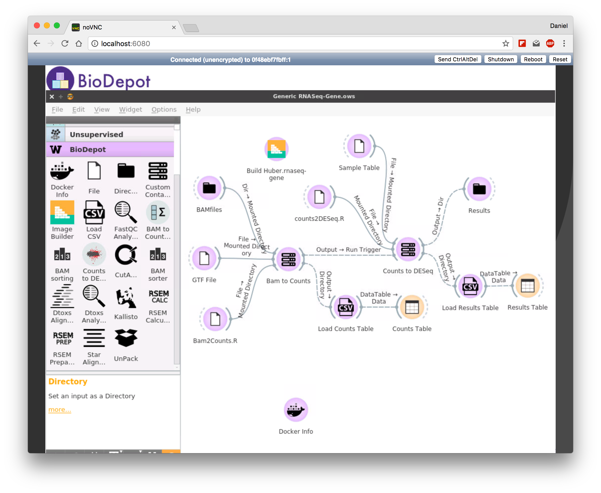

### A sample workflow DToxS for RNA-Seq.  

The data for this workflow is publicly available at https://martip03.u.hpc.mssm.edu/data.php. The pipeline performed both alignment and analysis. 

The alignment process uses Burroughs-Wheeler Aligner (BWA) [1]. The output of the alignment then fed into the analysis workflow by applying an R Script (source code: https://github.com/BioDepot/BioDepot-workflow-builder/tree/master/Widgets/bam2deseq) that leverages edgeR (Bioconductor package) [2]. 

The final result is 40 differentially expressed genes for each of drug perturbation. 

To use this workflow:
1) Download the RNASeq data at https://martip03.u.hpc.mssm.edu/data.php
2) Download this workflow file [Generic RNASeq-Gene.ows](Generic RNASeq-Gene.ows)
3) Download counts2DESeq.R and Bam2Counts.R from https://github.com/BioDepot/BioDepot-workflow-builder/tree/master/Widgets/bam2deseq
4) Mount all of the files so that it's accessible to the Orange/BioDepot.
5) Launch BioDepot 
6) File open -> select ows file.
7) Double-click on each input icons and select corresponding files. The workflow runs automatically as soon as the files are linked.

Note: The alignment process is computationally intensive and may take a while to complete, depending on your machine/configurations.

[1] H L, R D. Fast and accurate short read alignment with Burrows-Wheeler transform. Bioinformatics 2009;25(14):1754–60.

[2] McCarthy DJ, Chen Y, Smyth GK. Diferential expression analysis of multifactor RNA-Seq experiments with respect to biological variation. Nucleic acids research 2012;40(10):4288–4297.