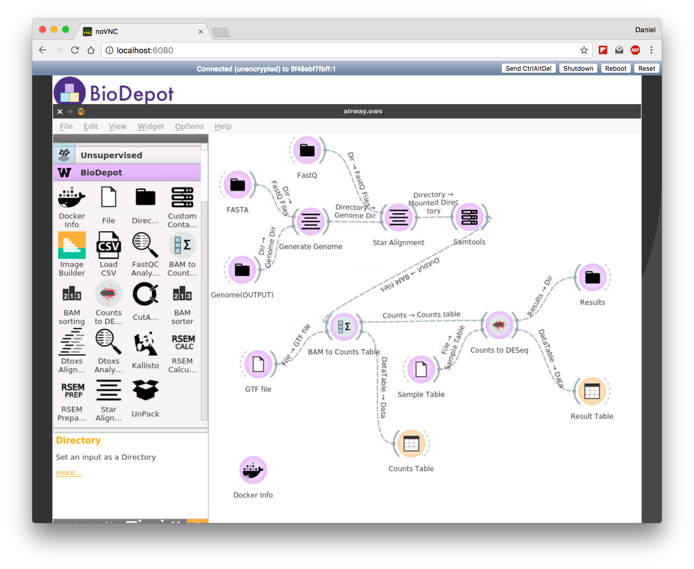

### Sample worflow: RNA-Seq at the gene level

This workflow is based Bioconductor - RNA-seq workflow at the gene level by Michael Love, et all: https://www.bioconductor.org/help/workflows/rnaseqGene/ 

This workflow includes alignment process (STAR Alignment), computing the count matrix, and identifying the differentially expressed genes using DESeq2. 

To run this workflow:
1) Download all the necessary dataset at: https: //www.ncbi.nlm.nih.gov/geo/query/acc.cgi?acc=GSE52778.
2) Download this workflow file [airway.ows](airway.ows)
3) Mount all of the files so that it's accessible to the Orange/BioDepot.
4) Launch BioDepot 
5) File open -> select ows file.
6) Double-click on each input icons and select corresponding files. The workflow runs automatically as soon as the files are linked.
