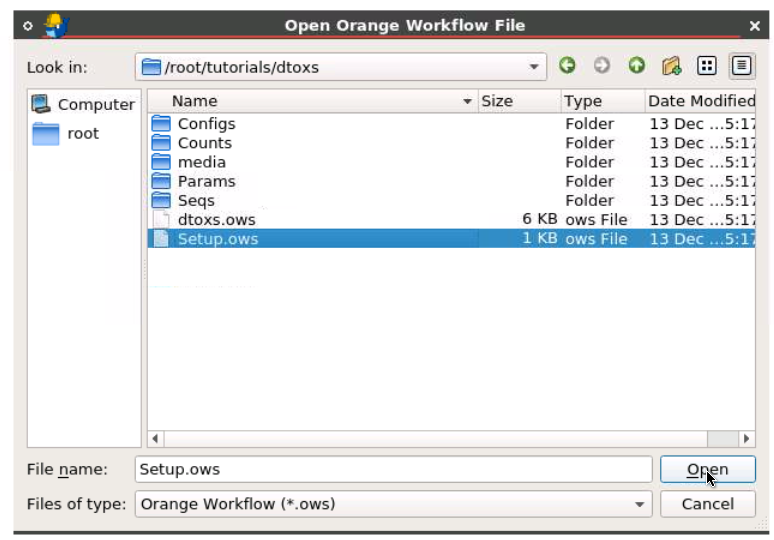
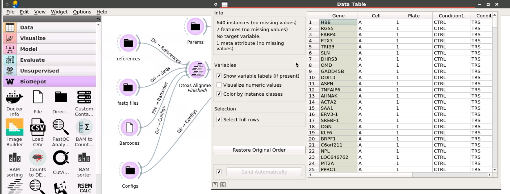

# Tutorial: DtoxS workflow

## Run [setup] workflow

The setup workflow widget downloads the tutorial files (for example the human reference data) needed to run Dtoxs workflow. This avoids carrying large data files inside the container. The widget is a custom container widget that calls a bash script inside the Bwb container. 

 The setup widget is stored in a mini-workflow file. Start up the Bwb application by following the instructions in the [manual](https://github.com/BioDepot/BioDepot-workflow-builder)

  
 After Bwb launches, open `/root/tutorials/dtoxs/Setup.ows` workflow. This is done by choosing open from the File menu as shown below.
 <table><tr><td>
  
 </td></tr></table>

Once the dialog opens up navigate to the /root/tutorials/dtoxs/ directory and choose the Setup.ows file to open

  

You should see a single widget:
 
 
 
 After double-clicking on the icon you should see the custom container form below.

The fields are already filled in. 

The Docker image defines container to be used which in this case the same container that is running Bwb. 

The Mount Mapping field defines which directories inside the container are to be mapped from the widget container to the Bwb container directories. In this case the /data directory of the widget container will be mapped to the /data directory of the calling Bwb container. This Bwb container directory has also been mapped to your local ~/Desktop directory when the user started up the Bwb container. We will use these mappings to write the data files out to the user directory.

The Run command points to the bash script inside this container that will by run by the widget inside the container. So when the widget is started it will run the bash script inside the same container that is running Bwb. 

Click on the start button to run the script and download all the files needed to run the tutorial.

Once the data has been downloaded by the widget you should see a 'Finished!' flag under the widget.

When this is finished you should see a new tutorial directory in your local ~/Desktop directory. This will contain all the necessary files for you to run the DetoxS pipeline.

## Run DetoxS pipeline

Open `/data/tutorials/dtoxs/dtoxs.ows` workflow.  The workflow is set to start the analyses step automatically. The sample input files are very small and should only take a few seconds to complete the alignment step. Under the alignment widget you should see the Running indicator. This becomes a Finished indicator when the alignment is done.

Start the analysis step by double click the [Dtoxs Analysis] icon and [Run].

This should take a few minutes to finish. When it is done you can click on the Table widget to see a list of the top 40 differentially expressed genes for the sample data.
 <table><tr><td>
  
 </td></tr></table>

The Analysis widget in the pipeline is also connected to the Results directory. Clicking on the widget gives the full path of the directory. The complete results have been written to this directory.

 <table><tr><td>
  
 </td></tr></table>

To quit the tutorial - choose quit from the File menu. Then right-click on the Desktop and choose Quit Container to quit the Bwb container.

