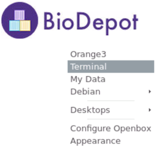
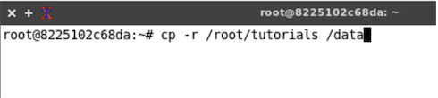

# Tutorial: Dtoxs workflow

## Preparation 
Start the [Terminal] inside the Bwb desktop.


## Copy tutorial folder to /data
Inside the Bwb container, the tutorial folder locate at `/root/tutorials`, copy this folder to /data (which mounted from the host).

Command:
```
cp -r /root/tutorials /data
```


## Run setup workflow
The setup workflow helps to download reference data for running Dtoxs workflow.
Open `setup.ows` workflow in `/data/tutorials/dtoxs`, then run this workflow which will fetch the data automatically.


## Run pipeline
Open `dtoxs.ows` workflow in `/data/tutorials/dtoxs`, the workflow will be started automatically (Be sure the setup workflow was run before run dtoxs workflow, otherwise there will be no results since the input data is not ready). Once the alignment was finished, start the analysis step by double click the [Dtoxs Analysis] icon and [Run].


