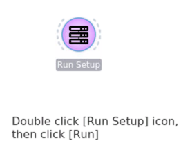
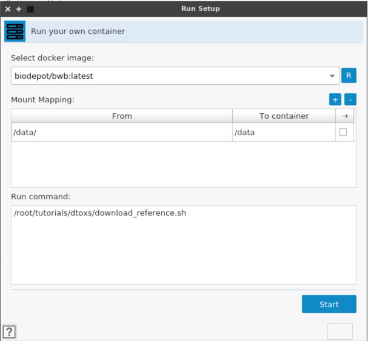
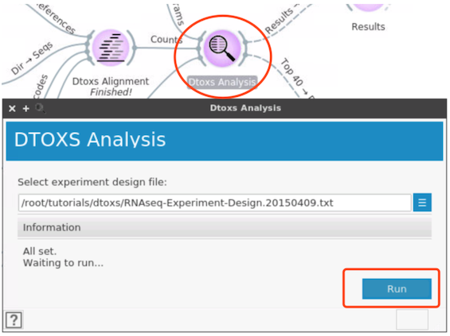

# Tutorial: Dtoxs workflow

## Preparation 

## Run [setup] workflow

The setup workflow helps to download reference data for running Dtoxs workflow.
Open `/root/tutorials/dtoxs/Setup.ows` workflow, then run this workflow which will prepare the data for dtoxs tutorial.

## Run pipeline

Open `/data/tutorials/dtoxs/dtoxs.ows` workflow, the workflow will be started automatically (Be sure the setup workflow was run before the Dtoxs pipeline, otherwise there will be no results since the input data is not ready). Once the alignment was finished, start the analysis step by double click the [Dtoxs Analysis] icon and [Run].

