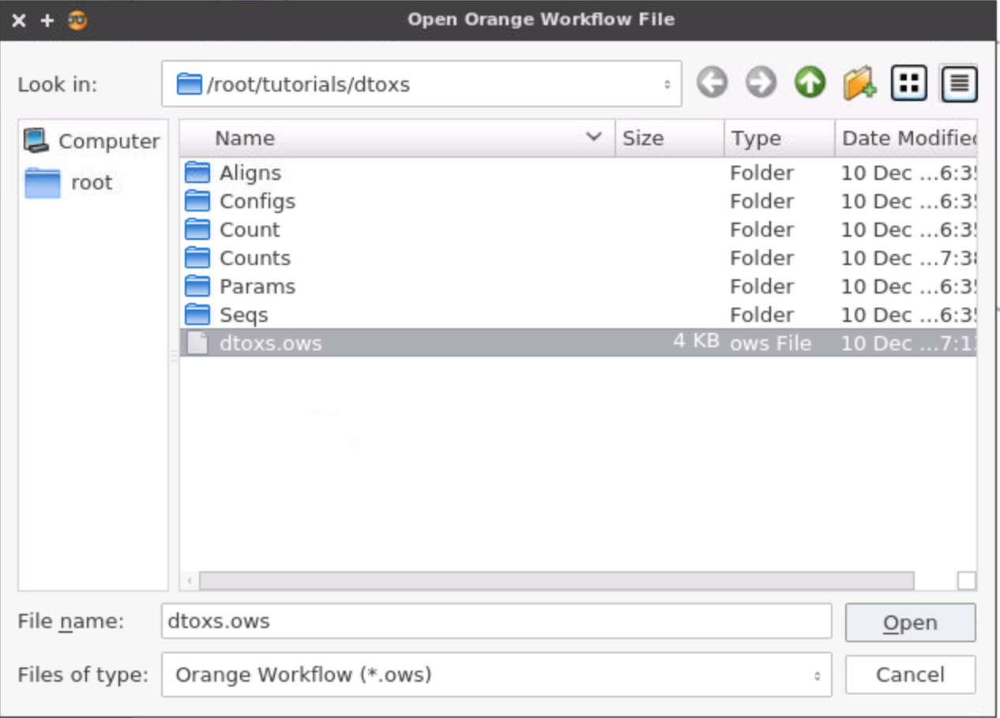
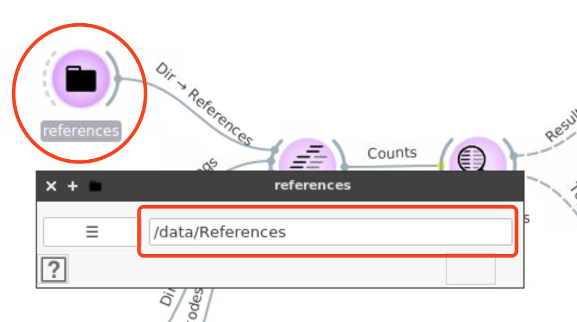
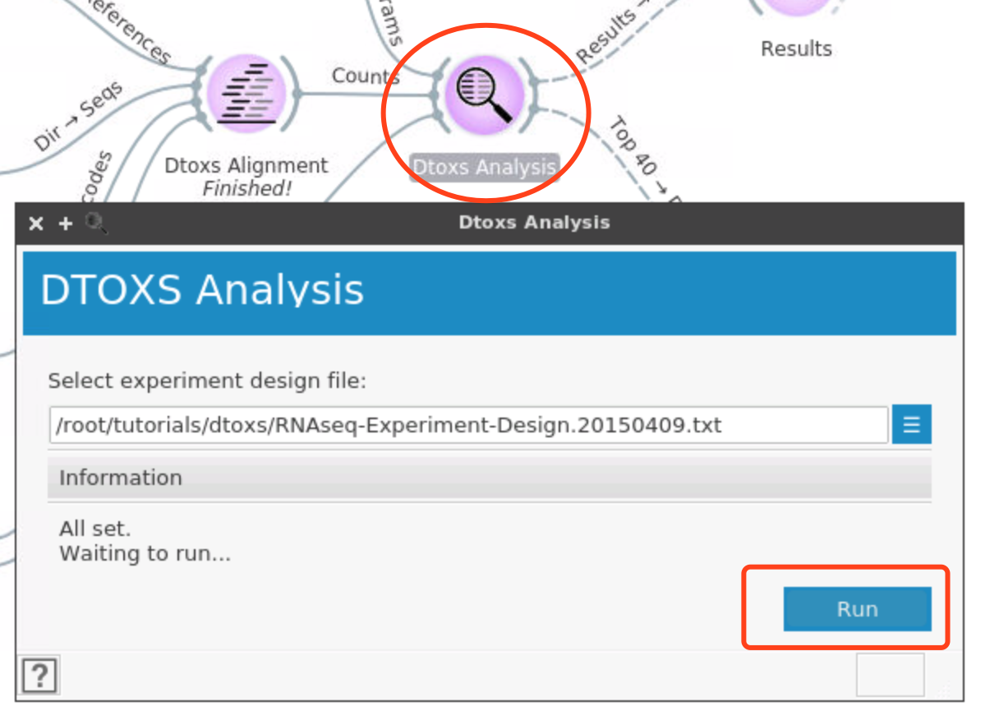

DTOXS Tutorial

## Start BwB
``` 
docker run -p 6080:6080 -v ${PWD}:/data -v /var/run/docker.sock:/var/run/docker.sock biodepot/bwb
```

## Open Dtoxs workflow
OWS file: /root/tutorials/dtoxs/dtoxs.ows



## Download Reference data
```sh
cp [BioDepot-Workflow-Builder]/Tutorials/dtoxs/download_reference.sh ./

chmod +x download_reference.sh
./download_reference.sh
```

## Set Reference directory



## Run pipeline
The alignment step should be run automatically when `Reference` was set. Once the alignment was finished, start the analysis step.

